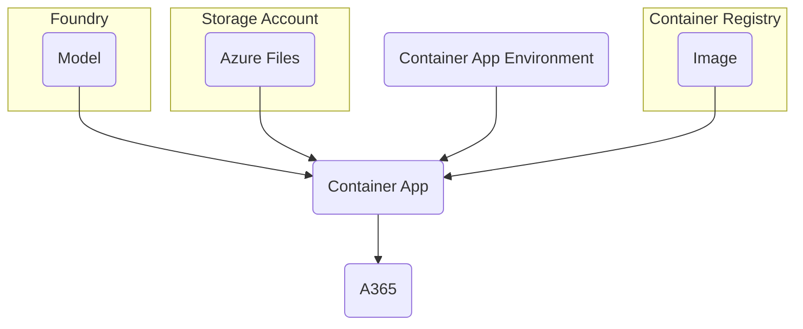

> Microsoft Agent 365 python samples: https://github.com/microsoft/Agent365-Samples/tree/main/python/

# Part I. Reusable resources setup

## 1. Reusable resources

The sample agents are deployed in container apps and depends on several resources that can be shared between agents:

| Resource | Description |
|---|---|
| Container app environment | _Container_ for container apps.<br>Connects to Azure files via SAS key for volume mounts to file shares. |
| Container registry | Hosts the agent images that have the respective python packages built into the images.<br>Authenticates via container app's UAMI. |
| Azure files | Agent code is intentionally separated away from the image for _development_.<br>Agent code would typically be baked into the image for _production_. |
| Foundry | Provides the model deployment.<br>Authenticates via container app's UAMI. |



### 1.1. Parameters setup

> [!Important]
>
> The setup is performed in Cloud Shell (bash) in Azure portal, which already has `az`, `dotnet`, `python` and `pwsh` (v7) tools.
>
> (it even has most bash utilities like `vi` and `envsubst`)
>
> This is convenient, but the session is **ephemeral**, so any files to be kept from the session must be download via `Manage files` from the Cloud Shell.

1. Set az CLI to desired subscription (so that future az commands use this subscription without needing `--subscription`)
2. Setup the shell/environment variables (uses a shared `$PROJECT` name)
3. Create the resource group for the project

```sh
az account set --subscription <subscription-id>
export LOCATION='southeastasia'
PROJECT='<desired-name>'$(uuidgen | head -c 8)
export RG='rg-'$PROJECT
az group create --name $RG --location $LOCATION
```

> [!Note]
>
> 1. Storage account and ACR names need to be globally unique, `$(uuidgen | head -c 8)` helps to get a sort-of random alphanumeric suffix to have a sufficiently unique name
> 2. Certain variables in this write-up are exported because they are used for `envsubst` later to be substituted into the container app manifest files.
>
> Shell vs environment variables:
>
> |  | Shell variables | Environment variables|
> |---|---|---|
> | Scope | **Local** to the current shell process | **Global** to the shell and all spawned child processes. |
> | Viewing command | `set` (displays all shell and environment variables) | `env` or `printenv` |

### 1.2. One-time subscription resource providers registration

The subscription needs to be registered for `Microsoft.OperationalInsights` and `Microsoft.ContainerRegistry` resource provider for container apps environment and container registry creation.

```sh
az provider register --namespace Microsoft.OperationalInsights
az provider register --namespace Microsoft.ContainerRegistry
```

Check the registration state, it can take some time to change from `Registering` to `Registered`:

```sh
az provider show --namespace Microsoft.OperationalInsights --query "registrationState"
az provider show --namespace Microsoft.ContainerRegistry --query "registrationState"
```

## 2. Foundry

Setup resource names based on project name:

```sh
FOUNDRY_NAME='foundry-'$PROJECT
FOUNDRY_PROJECT='proj-'$PROJECT
export FOUNDRY_MODEL='gpt-5.4-mini'
```

Create Foundry resource:

```sh
az cognitiveservices account create \
  --name $FOUNDRY_NAME --resource-group $RG --location $LOCATION --kind 'AIServices' \
  --sku 'S0' --allow-project-management 'true' --custom-domain $FOUNDRY_NAME --yes
```

> Delete and purge Foundry resource (if need to redo)
> 
> ```sh
> az cognitiveservices account delete --name $FOUNDRY_NAME --resource-group $RG
> az cognitiveservices account purge --name $FOUNDRY_NAME --resource-group $RG --location $LOCATION
> ```

Create Project under the Foundry resource:

```sh
az cognitiveservices account project create \
  --name $FOUNDRY_NAME --resource-group $RG --location $LOCATION \
  --project-name $FOUNDRY_PROJECT --display-name $FOUNDRY_PROJECT
```

Create model deployment:

```sh
MODEL_VERSION=$(az cognitiveservices model list --location $LOCATION --query "[?model.name=='${FOUNDRY_MODEL}'&&kind=='AIServices'].model.version" -o tsv)
az cognitiveservices account deployment create \
  --name $FOUNDRY_NAME --resource-group $RG --deployment-name $FOUNDRY_MODEL --model-name $FOUNDRY_MODEL \
  --model-version $MODEL_VERSION --model-format 'OpenAI' --sku-capacity 500 --sku 'GlobalStandard'
```

Export project endpoint and model environment variables:

```sh
export FOUNDRY_PROJECT_ENDPOINT=$(az cognitiveservices account project show --name $FOUNDRY_NAME --resource-group $RG --project-name $FOUNDRY_PROJECT --query 'properties.endpoints' -o tsv)
```

## 3. Azure Files

Create storage account (storage account name cannot contain dashes):

```sh
SA_NAME='stor'$PROJECT
az storage account create --name $SA_NAME --resource-group $RG --location $LOCATION --sku Standard_LRS --tags SecurityControl=Ignore
```

## 4. Container Apps Environment

Create Container Apps environment:

```sh
CAE_NAME='cae-'$PROJECT
az containerapp env create --name $CAE_NAME --resource-group $RG --location $LOCATION
```

Verify container app environment ID:

```sh
export CAE_ID=$(az containerapp env show --name $CAE_NAME --resource-group $RG --query id -o tsv)
```

Get container app environment domain (for a365 CLI messaging endpoint):

```sh
CAE_DOMAIN=$(az containerapp env show --name $CAE_NAME --resource-group $RG --query "properties.defaultDomain" --output tsv)
```

## 4. Container Registry

Create ACR (ACR name cannot contain dashes):

```sh
export ACR_NAME='acr'$PROJECT
az acr create --name $ACR_NAME --resource-group $RG --location $LOCATION --sku Basic --tags SecurityControl=Ignore
```

# Part II. Per-agent setup

Set `SAMPLE` to the agent runtime (different path from the `samples` path):

```sh
SAMPLE='agent-framework'
# or
SAMPLE='langchain'
```

## 1. Create UAMI for the agent app

```sh
UAMI_NAME="uami-$APP_NAME"
az identity create --name $UAMI_NAME --resource-group $RG
```

Get UAMI service principal ID:

```sh
UAMI_ID=$(az identity show --name $UAMI_NAME --resource-group $RG --query principalId -o tsv)
```

Export UAMI client ID and resource ID as environment variable (for later container app deployment use):

```sh
export UAMI_CLIENT_ID=$(az identity show --name $UAMI_NAME --resource-group $RG --query clientId -o tsv)
export UAMI_RSC_ID=$(az identity show --name $UAMI_NAME --resource-group $RG --query id -o tsv)
```

#### 1.1. Assign Foundry role to UAMI

```sh
FOUNDRY_ID=$(az cognitiveservices account show --name $FOUNDRY_NAME --resource-group $RG --query id -o tsv)
az role assignment create --assignee $UAMI_ID --role 'Cognitive Services User' --scope $FOUNDRY_ID
```

#### 1.2. Assign ACR role to UAMI

```sh
ACR_ID=$(az acr show --name $ACR_NAME --query id -o tsv)
az role assignment create --assignee $UAMI_ID --role AcrPull --scope $ACR_ID
```

## 2. Create file share

```sh
CONN_STR=$(az storage account show-connection-string --name $SA_NAME --resource-group $RG --query connectionString -o tsv)
az storage share create --name $APP_NAME --connection-string "$CONN_STR"
```

### 2.1. Download app files from GitHub and upload to file share

```sh
FILES=$(curl -s https://api.github.com/repos/joetanx/mslab/contents/agent-365/samples/$SAMPLE/app | jq -r '.[] | .name')
for FILE in $FILES; do
  curl -sLO https://github.com/joetanx/mslab/raw/refs/heads/main/agent-365/samples/$SAMPLE/app/$FILE
  az storage file upload --share-name $APP_NAME --source $FILE --connection-string $CONN_STR
done
```

### 2.2. Register file share in container app environment

```sh
SA_KEY=$(az storage account keys list --account-name $SA_NAME --resource-group $RG --query "[0].value" -o tsv)
az containerapp env storage set \
  --name $CAE_NAME --storage-name $APP_NAME --resource-group $RG \
  --azure-file-account-name $SA_NAME --azure-file-account-key "$SA_KEY" \
  --azure-file-share-name $APP_NAME --access-mode ReadOnly
```

## 3. Build agent image in ACR

```sh
curl -sLO "https://github.com/joetanx/mslab/raw/refs/heads/main/agent-365/samples/$SAMPLE/{pyproject.toml,Dockerfile}"
az acr build --registry $ACR_NAME --image $APP_NAME:latest --file Dockerfile .
```

## 4. Agent 365 CLI

Install a365 CLI in the Cloud Shell:

```sh
dotnet tool install --global Microsoft.Agents.A365.DevTools.Cli
export PATH=$PATH:/home/system/.dotnet/tools/
```

> [!Tip]
>
> Run `a365 setup requirements` to verify if the tenant has the necessary prerequisites (e.g. `Agent 365 CLI` app registration).
>
> Read more about the prerequisites: https://github.com/joetanx/mslab/blob/main/agent-365/a365-cli.md

```sh
MESSAGING_ENDPOINT="https://$APP_NAME.$CAE_DOMAIN/api/messages"
a365 setup all --aiteammate -n $APP_NAME --messaging-endpoint $MESSAGING_ENDPOINT
```

> [!Important]
>
> Download the `a365.config.json` and `a365.generated.config.json` files from the cloud shell and keep them.
>
> The a365 CLI references these config files to resume the work on the agent for future commands.

Export variables:

```sh
export TENANT_ID=$(python3 -c "import json; print(json.load(open('a365.config.json'))['tenantId'])")
export BLUEPRINT_CLIENT_ID=$(python3 -c "import json; print(json.load(open('a365.generated.config.json'))['agentBlueprintId'])")
```

UAMI is used for Federated Identity Credential (FIC) for the blueprint, the `agentBlueprintClientSecret` can be discarded:

> [!Note]
>
> 1. `Application Administrator` or `Cloud Application Administrator` Entra role required to add FIC to agent blueprint
> 2. The principal ID (not client ID) of the UAMI is used to assign FIC

```sh
az ad app federated-credential create \
  --id $BLUEPRINT_CLIENT_ID \
  --parameters '{
    "name": "containerapp-uami-fic",
    "issuer": "https://login.microsoftonline.com/'"$TENANT_ID"'/v2.0",
    "subject": "'"$UAMI_ID"'",
    "audiences": ["api://AzureADTokenExchange"]
  }'
```

### 4.1. Configure tools

List availables tools in the [Agent 365 tools catalog](https://learn.microsoft.com/en-us/microsoft-agent-365/tooling-servers-overview#agent-365-tools-catalog):

```sh
a365 develop list-available
```

Add desired tools to the agent, this generates the `ToolingManifest.json` file:

```sh
for mcp in mcp_M365Copilot mcp_CalendarTools mcp_MailTools mcp_TeamsServer mcp_SharePointRemoteServer mcp_OneDriveRemoteServer mcp_WordServer mcp_MeServer; do
  a365 develop add-mcp-servers $mcp
done
```

> [!Note]
>
> These tools are now consider legacy:
> - mcp_ExcelServer
> - mcp_ODSPRemoteServer
> - mcp_WebSearchTools
> - mcp_SharePointListsTools
>
> Below warning occurs when trying to add legacy tools (but still usable at the time of writing):
>
> ```
> uses a legacy ATG audience and may not work correctly. Consider re-running add-mcp-servers to pick up the latest catalog.
> ```

Verify/view the tools configured in `ToolingManifest.json`

```sh
a365 develop list-configured
```

Run `setup all` again, or `setup permissions mcp` to grant the permissions required by the tool

```sh
a365 setup permissions mcp -n $APP_NAME
```

### 4.2. Publish agent manifest in M365 Admin Center

```sh
a365 publish
```

This command generates the `manifest/manifest.zip` file, download it from the cloud shell.

> [!Note]
>
> To edit the manifest in the cloud shell:
> 1. Use `Ctrl+Z` to send a365 CLI to background
> 2. `vi manifest/manifest.json` to edit the manifest file (e.g. change name, descriptions)
> 3. Exit vim with `:q`
> 4. Use `fg` to continue the a365 CLI

Upload the manifest to M365 Admin Center

1. Go to https://admin.cloud.microsoft/#/agents/all
2. From menu on top of the agents list, click the elipsis `…` and select `Add agent`
3. `Choose file` to select the `manifest.zip` file
4. Select the desired users or groups to `Activate` for
5. Select the template to apply, review permission, then `Publish`

## 5. Deploy container app

Download manifest template and replace placeholders with environment variables

```sh
curl -sLO https://github.com/joetanx/mslab/raw/refs/heads/main/agent-365/samples/langchain/containerapp.yaml
envsubst < containerapp.yaml > containerapp-edited.yaml
```

Deploy container app with edited manifest file:

```sh
az containerapp create --name "$APP_NAME" --resource-group $RG --yaml containerapp-edited.yaml
```
