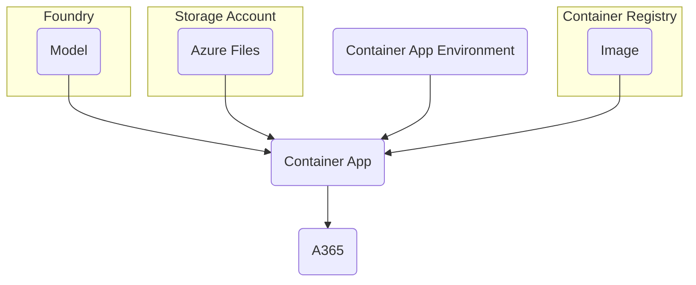

> Adapted from https://github.com/microsoft/Agent365-Samples/tree/main/python/agent-framework/sample-agent

## 1. Reusable resources setup

The sample agents are deployed in container apps and depends on several reusable resources:
- **Container app environment** - just a _container_ for container apps, establishs connection to Azure files via SAS key
- **Container registry** - hosts the agent images that have the respective python packages built into the images
- **Azure files** - agent code is intentionally separated away from the image for development, agent code would typically be baked into the image for production
- **Foundry** - provides the model deployment



### 1.1. Parameters setup

> [!Important]
>
> The setup is performed in Cloud Shell (bash) in Azure portal, which already has `az`, `dotnet`, `python` and `pwsh` (v7) tools.
>
> (it even has most bash utilities like `vi` and `envsubst`)
>
> This is convenient, but the session is **ephemeral**, so any files to be kept from the session must be download via `Manage files` from the Cloud Shell.

1. Set az CLI to desired subscription (so that future az commands use this subscription without needing `--subscription`)
2. Setup the shell/environment variables (uses a shared `$PROJECT` name)
3. Create the resource group for the project

```sh
az account set --subscription <subscription-id>
export LOCATION='southeastasia'
PROJECT='agentslab'
export RG='rg-'$PROJECT
az group create --name $RG --location $LOCATION
```

> [!Note]
>
> Certain variables in this write-up are `export`ed because they are used for `envsubst` later to be substituted into the container app manifest files.
>
> Shell vs environment variables:
>
> |  | Shell variables | Environment variables|
> |---|---|---|
> | Scope | **Local** to the current shell process | **Global** to the shell and all spawned child processes. |
> | Viewing command | `set` (displays all shell and environment variables) | `env` or `printenv` |

### 1.2. One-time subscription resource providers registration

The subscription needs to be registered for `Microsoft.OperationalInsights` and `Microsoft.ContainerRegistry` resource provider for container apps environment and container registry creation.

```sh
az provider register --namespace Microsoft.OperationalInsights
az provider register --namespace Microsoft.ContainerRegistry
```

Check the registration state, it can take some time to change from `Registering` to `Registered`:

```sh
az provider show --namespace Microsoft.OperationalInsights --query "registrationState"
az provider show --namespace Microsoft.ContainerRegistry --query "registrationState"
```

## 2. Foundry

Setup resource names based on project name:

```sh
FOUNDRY_NAME='foundry-'$PROJECT
PROJECT_NAME='proj-'$PROJECT
MODEL_NAME='gpt-5.4-mini'
```

Create Foundry resource:

```sh
az cognitiveservices account create \
  --name $FOUNDRY_NAME --resource-group $RG \
  --location $LOCATION --kind 'AIServices' --sku 'S0' \
  --allow-project-management 'true' --custom-domain $FOUNDRY_NAME --yes
```

> Delete and purge Foundry resource (if need to redo)
> 
> ```sh
> az cognitiveservices account delete --name $FOUNDRY_NAME --resource-group $RG
> az cognitiveservices account purge --name $FOUNDRY_NAME --resource-group $RG --location $LOCATION
> ```

Create Project under the Foundry resource:

```sh
az cognitiveservices account project create \
  --name $FOUNDRY_NAME --resource-group $RG --location $LOCATION \
  --project-name $PROJECT_NAME --display-name $PROJECT_NAME
```

Create model deployment:

```sh
MODEL_VERSION=$(az cognitiveservices model list --location $LOCATION --query "[?model.name=='${MODEL_NAME}'&&kind=='AIServices'].model.version" -o tsv)
az cognitiveservices account deployment create \
  --name $FOUNDRY_NAME --resource-group $RG --deployment-name $MODEL_NAME \
  --model-name $MODEL_NAME --model-version $MODEL_VERSION --model-format 'OpenAI' \
  --sku-capacity 500 --sku 'GlobalStandard'
```

Export project endpoint and model environment variables:

```sh
export FOUNDRY_PROJECT_ENDPOINT=$(az cognitiveservices account project show --name $FOUNDRY_NAME --resource-group $RG --project-name $PROJECT_NAME  --query 'properties.endpoints' -o tsv)
export FOUNDRY_MODEL=$MODEL_NAME
```

## 3. Azure Files

Create storage account (storage account name cannot contain dashes):

```sh
SA_NAME='stor'$PROJECT
az storage account create --name $SA_NAME --resource-group $RG --location $LOCATION --sku Standard_LRS --tags SecurityControl=Ignore
```

## 4. Container Apps Environment

Create Container Apps environment:

```sh
CAE_NAME='cae-'$PROJECT
az containerapp env create --name $CAE_NAME --resource-group $RG --location $LOCATION
```

Verify container app environment ID:

```sh
export CAE_ID=$(az containerapp env show --name $CAE_NAME --resource-group $RG --query id -o tsv)
```

Get container app environment domain (for a365 CLI messaging endpoint):

```sh
CAE_DOMAIN=$(az containerapp env show --name $CAE_NAME --resource-group $RG --query "properties.defaultDomain" --output tsv)
```

## 4. Container Registry

Create ACR (ACR name cannot contain dashes):

```sh
export ACR_NAME='acr'$PROJECT
az acr create --name $ACR_NAME --resource-group $RG --location $LOCATION --sku Basic --tags SecurityControl=Ignore
```

## X. Tasks moving to per agent

### Create UAMI

```sh
UAMI_NAME="uami-$APP_NAME"
az identity create --name $UAMI_NAME --resource-group $RG
```

Get UAMI service principal ID:

```sh
UAMI_ID=$(az identity show --name $UAMI_NAME --resource-group $RG --query principalId -o tsv)
```

Export UAMI client ID and resource ID as environment variable (for later container app deployment use):

```sh
export UAMI_CLIENT_ID=$(az identity show --name $UAMI_NAME --resource-group $RG --query clientId -o tsv)
export UAMI_RSC_ID=$(az identity show --name $UAMI_NAME --resource-group $RG --query id -o tsv)
```

#### Assign Foundry role to UAMI

```sh
FOUNDRY_ID=$(az cognitiveservices account show --name $FOUNDRY_NAME --resource-group $RG --query id -o tsv)
az role assignment create --assignee $UAMI_ID --role 'Cognitive Services User' --scope $FOUNDRY_ID
```

#### Assign ACR role to UAMI

```sh
ACR_ID=$(az acr show --name $ACR_NAME --query id -o tsv)
az role assignment create --assignee $UAMI_ID --role AcrPull --scope $ACR_ID
```

### Create file share

```sh
CONN_STR=$(az storage account show-connection-string --name $SA_NAME --resource-group $RG --query connectionString -o tsv)
az storage share create --name $APP_NAME --connection-string "$CONN_STR"
```

Download app files from GitHub and upload to file share:

```sh
for FILE in start_with_generic_host.py host_agent_server.py agent.py agent_interface.py mcp_tool_registration_service.py token_cache.py; do
  curl -sLO "https://github.com/joetanx/mslab/raw/refs/heads/main/agent-365/samples/langchain/app/$FILE"
  az storage file upload --share-name $APP_NAME --source $FILE --connection-string $CONN_STR
done
```

### Register file share in container app environment

```sh
SA_KEY=$(az storage account keys list --account-name $SA_NAME --resource-group $RG --query "[0].value" -o tsv)
az containerapp env storage set \
  --name $CAE_NAME --storage-name $APP_NAME --resource-group $RG \
  --azure-file-account-name $SA_NAME --azure-file-account-key "$SA_KEY" \
  --azure-file-share-name $APP_NAME --access-mode ReadOnly
```

### Build agent image in ACR

```sh
curl -sLO "https://github.com/joetanx/mslab/raw/refs/heads/main/agent-365/samples/langchain/{pyproject.toml,Dockerfile}"
az acr build --registry $ACR_NAME --image $APP_NAME:latest --file Dockerfile .
```
