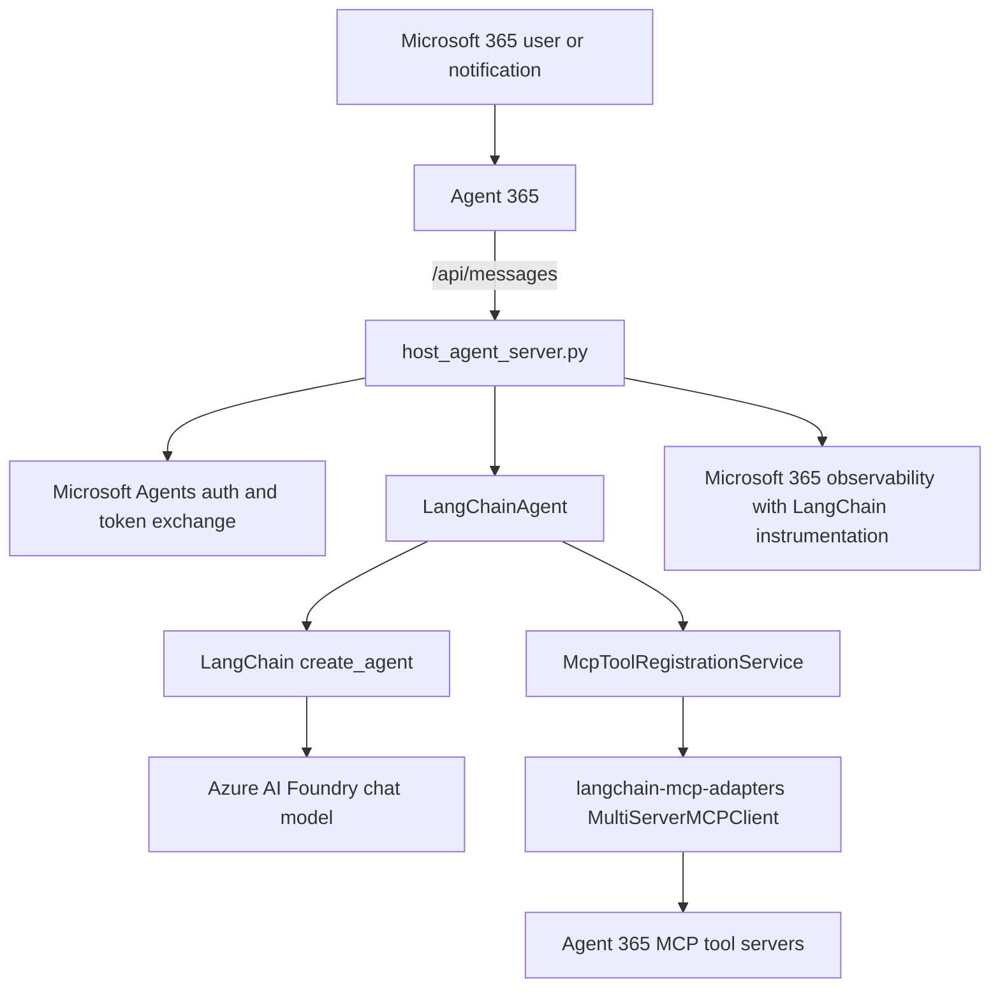

# LangChain sample agent

This sample hosts a Microsoft Agent 365 agent that uses LangChain for agent orchestration, Azure AI Foundry for model inference, Agent 365 MCP tooling for Microsoft 365 tools, and the Microsoft Agents SDK for HTTP hosting, authentication, and notification routing.

The sample is intended for Azure Container Apps deployment. The container image contains Python dependencies, while the application files under `app` are mounted from Azure Files for faster development iteration.

## Architecture

## What this sample provides

| Area | Implementation |
| --- | --- |
| Agent runtime | LangChain `create_agent` |
| Model integration | `init_chat_model("azure_ai:<deployment>")` from `langchain-azure-ai` |
| Model identity | `ManagedIdentityCredential` using `UAMI_CLIENT_ID` |
| HTTP host | `aiohttp` server through Microsoft Agents SDK |
| Message endpoint | `POST /api/messages` |
| Health endpoint | `GET /api/health` |
| Tooling | Agent 365 MCP tool servers exposed as LangChain tools |
| MCP adapter | `langchain_mcp_adapters.client.MultiServerMCPClient` |
| Notifications | Email and Word comment notification handling |
| Observability | Microsoft OpenTelemetry with LangChain instrumentation enabled |
| Deployment target | Azure Container Apps with an Azure Files app mount |

## File map

| Path | Purpose |
| --- | --- |
| `app\start_with_generic_host.py` | Process entrypoint. Imports `LangChainAgent` and starts the generic host. |
| `app\host_agent_server.py` | Shared Microsoft Agents host. Configures auth, activity handlers, notifications, typing indicators, health checks, and observability. |
| `app\agent.py` | LangChain implementation. Creates the Azure AI Foundry chat model, builds the LangChain agent, registers MCP tools, and processes messages and notifications. |
| `app\mcp_tool_registration_service.py` | LangChain-specific MCP registration service that converts Agent 365 MCP server configuration into LangChain tools. |
| `app\agent_interface.py` | Abstract contract that hosted agent implementations must satisfy. |
| `app\token_manager.py` | In-memory agentic token cache and exchange helper used by observability and MCP setup. |
| `containerapp.yaml` | Azure Container Apps manifest template. Values are substituted with `envsubst` before deployment. |
| `Dockerfile` | Multi-stage image that installs dependencies into a virtual environment and starts `start_with_generic_host.py`. |
| `pyproject.toml` | Python package dependencies for this sample. |

## Runtime flow

1. Azure Container Apps starts `python start_with_generic_host.py`.
2. `create_and_run_host(LangChainAgent)` validates the implementation and initializes Microsoft OpenTelemetry with LangChain instrumentation enabled.
3. `GenericAgentHost` loads Microsoft Agents SDK configuration from environment variables, configures MSAL service connection authentication, registers message and notification handlers, and exposes `/api/messages` and `/api/health`.
4. On startup, the host constructs `LangChainAgent`.
5. `LangChainAgent` creates an Azure AI Foundry chat model with `init_chat_model`, using the deployment named by `FOUNDRY_MODEL` and the project endpoint in `FOUNDRY_PROJECT_ENDPOINT`.
6. The agent initially starts with no tools so the host can become healthy before the first authenticated turn.
7. On the first user message or notification, `setup_mcp_servers` exchanges an agentic token, discovers configured Agent 365 MCP tool servers, converts them to LangChain tools, and recreates the LangChain agent with those tools attached.
8. User messages are processed with `self.agent.ainvoke({"messages": [{"role": "user", "content": message}]})`.
9. Responses are converted to text by `_extract_result` and sent back through Microsoft Agents SDK.

## Authentication and identity

This sample expects a user-assigned managed identity (UAMI) on the container app.

The UAMI is used for:

| Target | Required configuration |
| --- | --- |
| Azure AI Foundry | Assign `Cognitive Services User` to the Foundry account scope. |
| Azure Container Registry | Assign `AcrPull` to the registry scope. |
| Agent blueprint federated credentials | Create a federated credential on the blueprint app that trusts the UAMI principal ID. |
| Runtime model calls | Set `UAMI_CLIENT_ID` so `ManagedIdentityCredential` can authenticate the LangChain Azure AI model. |

Agentic user authorization is enabled by setting `AUTH_HANDLER_NAME=AGENTIC`. If this value is not set outside development mode, MCP registration raises an error because it cannot exchange the MCP platform token required to discover deployed tool servers.

## Required environment variables

| Variable | Required | Description |
| --- | --- | --- |
| `HOST` | Yes in container | HTTP bind host. Use `0.0.0.0` in Azure Container Apps. |
| `PORT` | Yes in container | HTTP port. The manifests use `3978`. |
| `FOUNDRY_PROJECT_ENDPOINT` | Yes | Azure AI Foundry project endpoint passed to `init_chat_model`. |
| `FOUNDRY_MODEL` | Yes | Foundry model deployment name used in `azure_ai:<deployment>`. |
| `UAMI_CLIENT_ID` | Yes | Client ID of the UAMI used by `ManagedIdentityCredential`. |
| `AUTH_HANDLER_NAME` | Required for production MCP | Set to `AGENTIC` to enable Agent 365 user authorization and token exchange. |
| `PYTHON_ENVIRONMENT` | Recommended | Set to `production` so Agent 365 tooling discovers deployed MCP tool configuration. |
| `ENABLE_OBSERVABILITY` | Recommended | Enables observability support. |
| `ENABLE_A365_OBSERVABILITY_EXPORTER` | Recommended | Enables the Agent 365 observability exporter. |
| `AGENT_PROMPT` | Optional | System instructions for the assistant. Defaults to `You are a helpful assistant.` |
| `TOKEN_REFRESH_BUFFER_SECONDS` | Optional | Number of seconds before expiry when cached tokens are treated as stale. Defaults to `300`. |
| `CONNECTIONS__SERVICE_CONNECTION__SETTINGS__*` | Yes for authenticated deployment | Microsoft Agents SDK service connection settings generated by `a365 setup all`. |
| `CONNECTIONSMAP__0__*` | Yes for authenticated deployment | Maps all service URLs to `SERVICE_CONNECTION`. |
| `AGENTAPPLICATION__USERAUTHORIZATION__HANDLERS__AGENTIC__SETTINGS__*` | Yes for Agent 365 auth | Configures agentic user authorization and Agent 365 scopes. |

## Deployment summary

The root [README.md](../README.md) contains the full Azure resource and Agent 365 setup. At a high level:

1. Create shared resources: resource group, Foundry resource and model deployment, storage account, Container Apps environment, and Azure Container Registry.
2. Set `SAMPLE='langchain'`.
3. Create a UAMI for this agent.
4. Grant the UAMI access to Foundry and ACR.
5. Create an Azure Files share named for the app and upload the files from `app`.
6. Build the image from this folder's `Dockerfile` and `pyproject.toml`.
7. Run `a365 setup all` with the container app messaging endpoint.
8. Configure MCP tools with `a365 develop add-mcp-servers`.
9. Grant MCP permissions with `a365 setup permissions mcp`.
10. Publish the Agent 365 manifest.
11. Substitute `containerapp.yaml` with environment variables and deploy it with `az containerapp create`.

## MCP tool behavior

The LangChain sample includes a custom `McpToolRegistrationService` because Agent 365 tooling does not directly return LangChain tools.

During the first turn:

1. `setup_mcp_servers` prepares an observability token and calls the registration service.
2. In production mode, the registration service exchanges an MCP platform token using `auth.exchange_token`.
3. `McpToolServerConfigurationService.list_tool_servers` discovers configured Agent 365 MCP servers for this agent.
4. Each server configuration is converted to a `MultiServerMCPClient` connection with HTTP transport, URL, user-agent header, optional server headers, and bearer authorization.
5. `MultiServerMCPClient.get_tools()` loads LangChain `BaseTool` instances.
6. `LangChainAgent` recreates the LangChain agent with the discovered tool list.
7. `mcp_servers_initialized` prevents re-registering the same tools on every turn.

If no server configurations are returned, the agent continues with its initial tool list.

## Notification behavior

The shared host routes Agent 365 notifications into `handle_agent_notification_activity`.

| Notification type | Behavior |
| --- | --- |
| Email | Extracts the email HTML body or plain body, asks the agent to follow any instructions in the email, and returns an `EmailResponse` activity. |
| Word comment | Retrieves document and comment context through the agent's MCP tools, then asks the agent to respond using that content. |
| Other | Sends the notification text or notification type to the agent and returns the generated response. |

## Customization

| Goal | Change |
| --- | --- |
| Change assistant behavior | Set `AGENT_PROMPT` in `containerapp.yaml` or modify `AGENT_PROMPT` in `app\agent.py`. |
| Add local LangChain tools | Add `BaseTool` instances to `self.tools` or pass them as `initial_tools` during `setup_mcp_servers`. |
| Change model deployment | Update `FOUNDRY_MODEL` and ensure the deployment exists in the Foundry project. |
| Change model provider | Replace `_create_model` in `app\agent.py` with another LangChain chat model factory. |
| Change notification handling | Extend `handle_agent_notification_activity` in `app\agent.py`. |
| Change MCP connection behavior | Modify `app\mcp_tool_registration_service.py`. |
| Change host behavior | Modify `app\host_agent_server.py`, which is shared in structure with the Agent Framework sample. |

## Troubleshooting

| Symptom | Likely cause | Check |
| --- | --- | --- |
| `/api/health` returns `agent_initialized: false` | Agent failed during startup. | Inspect container logs for import, managed identity, or Foundry errors. |
| Model calls fail with authentication errors | UAMI is missing or lacks Foundry access. | Verify `UAMI_CLIENT_ID` and the `Cognitive Services User` role assignment. |
| MCP registration raises `auth_handler_name is required outside development mode` | `AUTH_HANDLER_NAME` is unset while `PYTHON_ENVIRONMENT=production`. | Set `AUTH_HANDLER_NAME=AGENTIC` and ensure user authorization settings exist. |
| MCP tools are not available | MCP permissions or tooling configuration is missing. | Run `a365 develop list-configured` and `a365 setup permissions mcp -n $APP_NAME`. |
| LangChain tool calls fail with authorization errors | MCP server authorization header is missing or expired. | Verify token exchange succeeds and the Agent 365 authorization handler scopes are configured. |
| Container app cannot pull the image | UAMI lacks ACR pull permission or registry identity is wrong. | Verify `AcrPull` assignment and `${UAMI_RSC_ID}` in `containerapp.yaml`. |
| Health check fails in Azure Container Apps | App is not listening on the expected host or port. | Ensure `HOST=0.0.0.0`, `PORT=3978`, and ingress `targetPort` is `3978`. |
