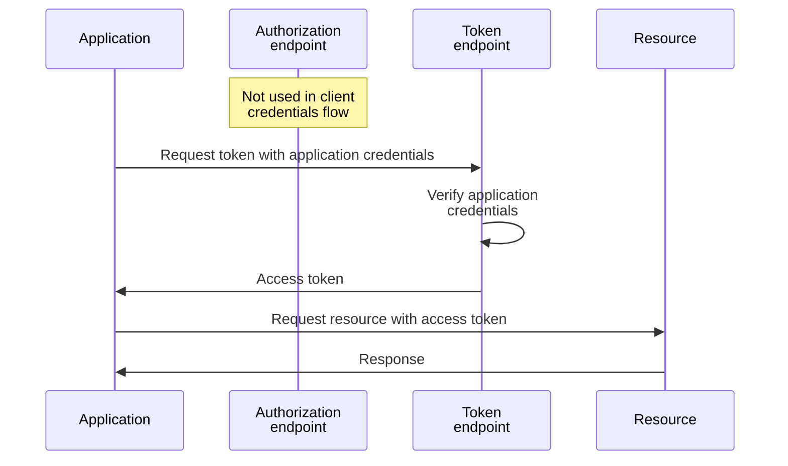
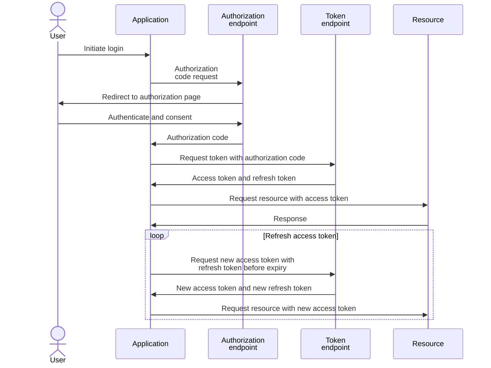
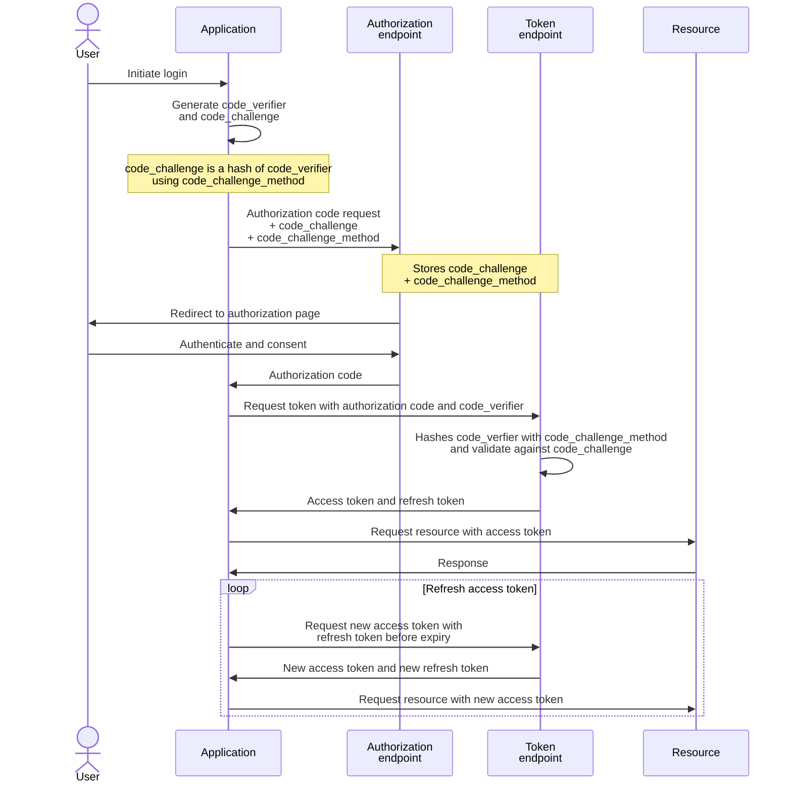

## 1. Entra applications

### 1.1. App registration and enterprise application

### 1.2. Application and delegated permissions

Entra permission reference: https://learn.microsoft.com/en-us/graph/permissions-reference

### 1.3. Azure and Defender RBAC

## 2. Authentication Flows

### 2.1. Client credential

### 2.2. Authorization code

#### 2.2.1. without Proof Key for Code Exchange (PKCE)

#### 2.2.2. with Proof Key for Code Exchange (PKCE)

### 2.3. On-behalf-of

```mermaid
sequenceDiagram
  actor A as User
  participant B as Application<br>(client)
  participant C as Authorization<br>endpoint
  participant D as Token<br>endpoint
  participant E as Application<br>(middle-tier)
  participant F as Resource
  rect rgb(32, 32, 32)
    note over A,D:Authorization code flow
    A->>B:Initiate login
    B->>C:Authorization<br>code request
    C->>A:Redirect to authorization page
    A->>C:Authenticate and consent
    C->>B:Authorization code
    B->>D:Request token (client) with authorization code
    D->>B:Token (client)
  end
  rect rgb(32, 32, 32)
    note over B,E:On-behalf-of flow
    B->>E:Send token (client) to middle-tier app
    E->>D:Request token (resource)<br>with token (client)
    E->>B:Return token (resource)
  end
  E->>F:Request resource<br>with token (resource)
  F->>E:Response
```

