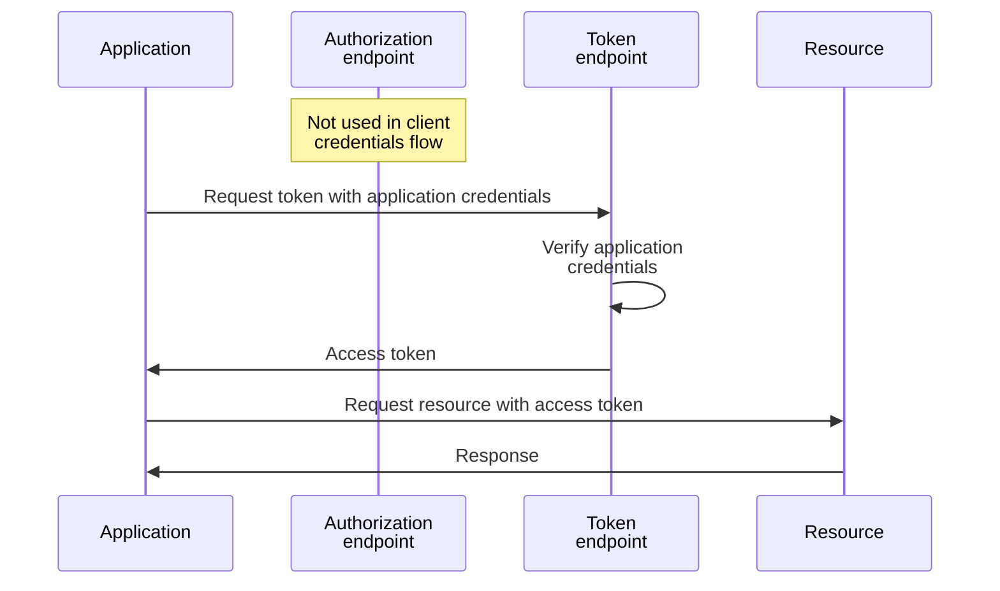
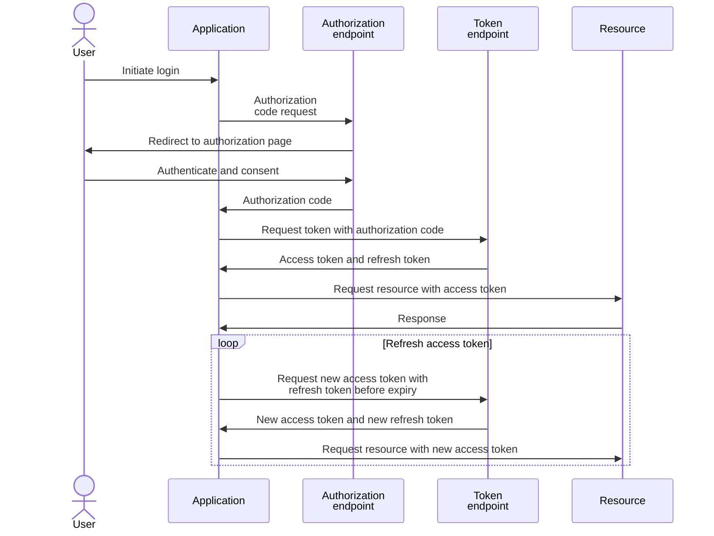
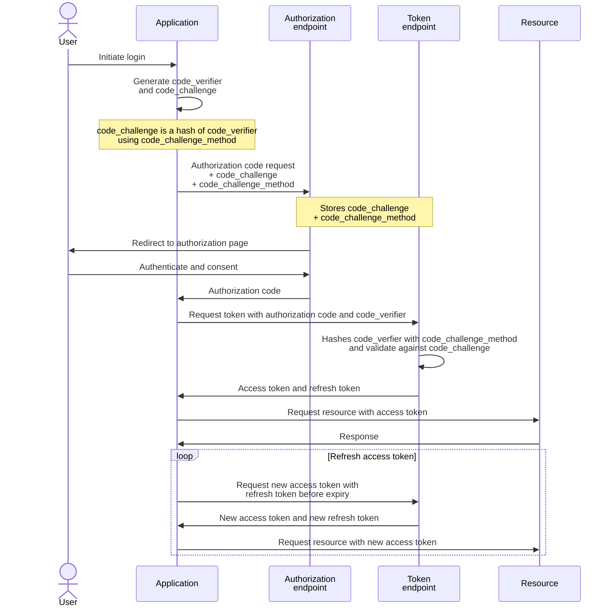

## 1. Entra applications

### 1.1. Entra identity endpoints

|Endpoint|URI prefix|Usage|
|---|---|---|
|Common|`https://login.microsoftonline.com/common/…`|A shared endpoint that supports sign-in for any tenant (multi-tenant apps) and also Microsoft personal accounts. It does not bind to a specific tenant until the user logs in.|
|Tenant-specific|`https://login.microsoftonline.com/<tenant_id>/…`|Bound to a specific tenant (identified by tenant ID or domain name). Only users from that tenant can authenticate.|

|Endpoint|URI suffix|
|---|---|
|OIDC well-known configuration|`…/v2.0/.well-known/openid-configuration`|
|`token_endpoint`|`…/oauth2/v2.0/token`|
|`authorization_endpoint`|`…/oauth2/v2.0/authorize`|
|`device_authorization_endpoint`|`…/oauth2/v2.0/devicecode`|
|`end_session_endpoint`|`…/oauth2/v2.0/logout`|

### 1.2. App registration

App registration is the **application object** which contains configurations like redirect URL, API permissions, credentials (client secrets, certificate, FIC) app roles, etc


|ID|Purpose|
|---|---|
|Application (client) ID|Unique ID of the **application object** in the Entra directory<br>Also known as AppID or client ID|
|Object ID|Unique ID of **the service principal object** associated with the application|
|Directory (tenant) ID|Unique ID of the Entra tenant|

#### 1.2.1. Application credentials

##### Client secret:

- The client secret is like an API key or client password
- Used in the `client_secret` parameter during authentication
- Good for testing, not recommended for production


##### Client certificate:

- The client certificate is used to sign the JWT that claims the application's identity
- The signed JWT is used the `client_assertion` parameter during authentication
- When using a certificate chain, upload the certificate that is signing the JWT to the app registration, not the root or intermediate CAs, the public key in the signing certificate is used to verify the JWT signature


##### Federated identity credential (FIC)

- The FIC represents the trust relationship between an external identity provider (IdP) and an app in Microsoft Entra ID
- Several scenarios of [workload identity federation](https://learn.microsoft.com/en-us/entra/workload-id/workload-identity-federation#supported-scenarios) are supported, includign the managed identity example below
- Note: it is not possible to use another application in Entra as FIC:
  - `AADSTS700222: AAD-issued tokens may not be used for federated identity flows.`


#### 1.2.2. API permissions

Entra permission reference: https://learn.microsoft.com/en-us/graph/permissions-reference

|Application Permission|Delegated Permission|
|---|---|
|**Non-interactive** and require admin approval because they give the app broad access across the tenant|**Interactive** and scoped to the signed-in user's privileges; the app can only do what the user can do, within the consented scope|
|||
||Tracking user consent<br>|

#### 1.2.3. Authentication

##### Redirect URI

- A [redirect URI](https://learn.microsoft.com/en-us/entra/identity-platform/how-to-add-redirect-uri) is where Entra sends tokens after authentication
- Specifying the redirect URIs ensures Entra only sends authorization codes to the intended recipient


##### Public client flow

- [Public client applications](https://learn.microsoft.com/en-us/entra/identity-platform/msal-client-applications) run on devices, such as desktop, browserless APIs, mobile or client-side browser apps
- They are not trusted to safely keep application secrets, so they can only access web APIs on behalf of the user


Auth code flow can work without client secret if the redirect url is configured for `Mobile and desktop applications`:


If redirect url configured as `Web` instead of `Mobile and desktop applications`: error when calling /token without `client_secret`/`client_assertion`:

```json
{
  "error": "invalid_client",
  "error_description": "AADSTS7000218: The request body must contain the following parameter: 'client_assertion' or 'client_secret'. Trace ID:51aef582-ffda-4487-8e26-e0e804582f00 Correlation ID: 9ae34de5-c41a-4c2c-8d56-443ba4b094d7 Timestamp: 2026-02-19 02:18:35Z",
  "error_codes": [
    7000218
  ],
  "timestamp": "2026-02-19 02:18:35Z",
  "trace_id": "51aef582-ffda-4487-8e26-e0e804582f00",
  "correlation_id": "9ae34de5-c41a-4c2c-8d56-443ba4b094d7",
  "error_uri": "https://login.microsoftonline.com/error?code=7000218",
  "claims": "{\"access_token\":{\"capolids\":{\"essential\":true,\"values\":[\"ff3efee0-276e-467d-9a11-21c413943b33\"]}}}"
}
```

### 1.3. Enterprise application

Enterprise application is the **service principal object** (i.e. service account or machine identity) created from the _application object_


#### 1.3.1. Permissions

#### 1.3.2. Group membership

#### 1.3.3. Azure and Defender RBAC

## 2. Authentication Flows

### 2.1. Client credential



### 2.2. Authorization code

#### 2.2.1. without Proof Key for Code Exchange (PKCE)



#### 2.2.2. with Proof Key for Code Exchange (PKCE)



### 2.3. On-behalf-of

```mermaid
sequenceDiagram
  actor A as User
  participant B as Application<br>(client)
  participant C as Authorization<br>endpoint
  participant D as Token<br>endpoint
  participant E as Application<br>(middle-tier)
  participant F as Resource
  rect rgb(32, 32, 32)
    note over A,D:Authorization code flow
    A->>B:Initiate login
    B->>C:Authorization<br>code request
    C->>A:Redirect to authorization page
    A->>C:Authenticate and consent
    C->>B:Authorization code
    B->>D:Request token (client) with authorization code
    D->>B:Token (client)
  end
  rect rgb(32, 32, 32)
    note over B,E:On-behalf-of flow
    B->>E:Send token (client) to middle-tier app
    E->>D:Request token (resource)<br>with token (client)
    E->>B:Return token (resource)
  end
  E->>F:Request resource<br>with token (resource)
  F->>E:Response
```


