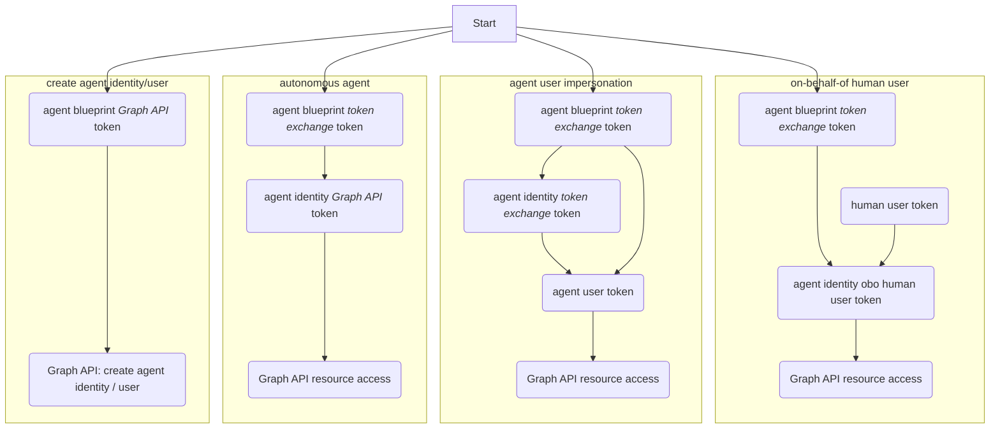

## 1. Authorization flows in Entra identity

```mermaid
flowchart TD
  subgraph on-behalf-of human user
    B4(agent blueprint <i>token exchange</i> token) ---> OBO(agent identity obo human user token)
    HU(human user token) --> OBO
    OBO --> G4(Graph API resource access)
  end
  subgraph agent user impersonation
    B3(agent blueprint <i>token exchange</i> token) --> I2(agent identity <i>token exchange</i> token)
    I2 --> AU(agent user token)
    B3 --> AU
    AU --> G3(Graph API resource access)
  end
  subgraph autonomous agent
    B2(agent blueprint <i>token exchange</i> token) --> I1(agent identity <i>Graph API</i> token)
    I1 ---> G2(Graph API resource access)
  end
  subgraph create agent identity/user
    B1(agent blueprint <i>Graph API</i> token) ----> G1(Graph API: create agent identity / user)
  end
  Start --> B1
  Start --> B2
  Start --> B3
  Start --> B4
```
