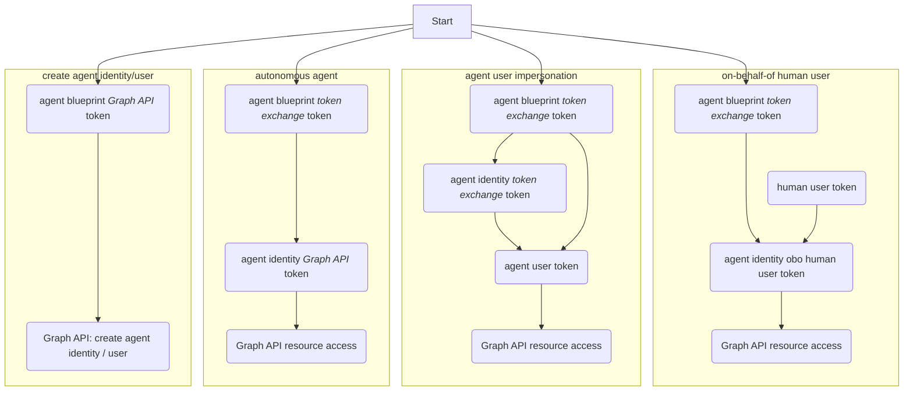

## 1. Authorization flows in Entra identity



## 2. Get agent blueprint token

### 2.1. Graph API access token

Agent blueprint needs to access Graph API to create agent identity and agent user

The `scope` used in the _access_ token request for Graph API is `https://graph.microsoft.com/.default`

#### 2.1.A. Using client secret

```pwsh
$body=@{
  client_id = $AgentIdBp.id
  client_secret = $AgentIdBpPw.secretText
  grant_type = 'client_credentials'
  scope = 'https://graph.microsoft.com/.default'
}
Invoke-RestMethod $token_endpoint -Method Post -Body $body | Tee-Object -Variable tokenAgentIdBp
$headersAgentIdBp = @{ Authorization='Bearer '+$tokenAgentIdBp.access_token }
```

#### 2.1.B. Using FIC (e.g. using Azure VM to get managed identity token)

##### 2.1.B.1. Get exchange token for MI [ᵈᵒᶜ](https://learn.microsoft.com/en-us/entra/identity/managed-identities-azure-resources/how-to-use-vm-token)

```pwsh
$endpointuri = 'http://169.254.169.254/metadata/identity/oauth2/token?api-version=2018-02-01&resource=api://AzureADTokenExchange'
Invoke-RestMethod $endpointuri -Headers @{Metadata="true"} | Tee-Object -Variable tokenMI
$tokenMI.access_token
```

##### 2.1.B.2. Exchange MI token for agent blueprint token [ᵈᵒᶜ](https://learn.microsoft.com/en-us/entra/agent-id/identity-platform/create-delete-agent-identities#get-an-access-token-using-agent-identity-blueprint)

```pwsh
$body=@{
  client_id = $AgentIdBp.id
  client_assertion_type = 'urn:ietf:params:oauth:client-assertion-type:jwt-bearer'
  client_assertion = $tokenMI.access_token
  grant_type = 'client_credentials'
  scope = 'https://graph.microsoft.com/.default'
}
Invoke-RestMethod $token_endpoint -Method Post -Body $body | Tee-Object -Variable tokenAgentIdBp
$headersAgentIdBp = @{ Authorization='Bearer '+$tokenAgentIdBp.access_token }
```

### 2.2. Token exchange token

Agent blueprint provides the credentials for agent identity and agent user authorization via token exchange

The `scope` used in the _token exchange_ token request for Graph API is `api://AzureADTokenExchange/.default`

#### 2.2.A. Using client secret

```pwsh
$body=@{
  client_id = $AgentIdBp.id
  client_secret = $AgentIdBpPw.secretText
  fmi_path = $AgentId.id
  grant_type = 'client_credentials'
  scope = 'api://AzureADTokenExchange/.default'
}
Invoke-RestMethod $token_endpoint -Method Post -Body $body | Tee-Object -Variable tokenAgentIdBp
```

#### 2.2.B. Using FIC (e.g. using Azure VM to get managed identity token)

##### 2.2.B.1. Get exchange token for MI [ᵈᵒᶜ](https://learn.microsoft.com/en-us/entra/identity/managed-identities-azure-resources/how-to-use-vm-token)

```pwsh
$endpointuri = 'http://169.254.169.254/metadata/identity/oauth2/token?api-version=2018-02-01&resource=api://AzureADTokenExchange'
Invoke-RestMethod $endpointuri -Headers @{Metadata="true"} | Tee-Object -Variable tokenMI
$tokenMI.access_token
```

##### 2.2.B.2. Exchange MI token for agent blueprint token [ᵈᵒᶜ](https://learn.microsoft.com/en-us/entra/agent-id/identity-platform/autonomous-agent-request-tokens#request-a-token-for-the-agent-identity-blueprint)

```pwsh
$body=@{
  client_id = $AgentIdBp.id
  client_assertion_type = 'urn:ietf:params:oauth:client-assertion-type:jwt-bearer'
  client_assertion = $tokenMI.access_token
  fmi_path = $AgentId.id
  grant_type = 'client_credentials'
  scope = 'api://AzureADTokenExchange/.default'
}
Invoke-RestMethod $token_endpoint -Method Post -Body $body | Tee-Object -Variable tokenAgentIdBp
```
