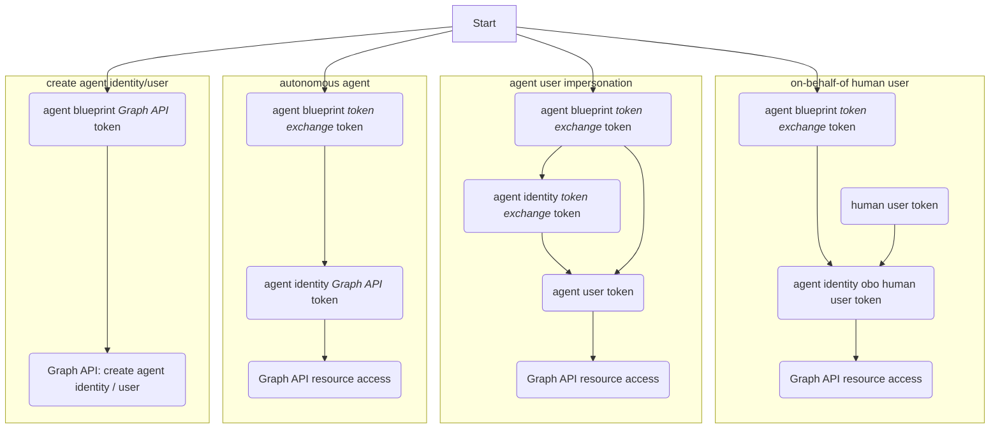

## 1. Entra agent identity authorization flows


```mermaid
flowchart TD
  subgraph on-behalf-of human user
    B4(agent blueprint <i>token exchange</i> token) ---> OBO(agent identity obo human user token)
    HU(human user token) --> OBO
    OBO --> G4(Graph API resource access)
  end
  subgraph agent user impersonation
    B3(agent blueprint <i>token exchange</i> token) --> I2(agent identity <i>token exchange</i> token)
    I2 --> AU(agent user token)
    B3 --> AU
    AU --> G3(Graph API resource access)
  end
  subgraph autonomous agent
    B2(agent blueprint <i>token exchange</i> token) ---> I1(agent identity <i>Graph API</i> token)
    I1 --> G2(Graph API resource access)
  end
  subgraph create agent identity/user
    B1(agent blueprint <i>Graph API</i> token) ----> G1(Graph API: create agent identity / user)
  end
  Start --> B1
  Start --> B2
  Start --> B3
  Start --> B4
```

## 2. Get agent blueprint token

### 2.1. Graph API access token

Agent blueprint needs to access Graph API to create agent identity and agent user

The `scope` used in the _access_ token request for Graph API is `https://graph.microsoft.com/.default`

#### 2.1.A. Using client secret

```pwsh
$body=@{
  client_id = $AgentIdBp.id
  client_secret = $AgentIdBpPw.secretText
  grant_type = 'client_credentials'
  scope = 'https://graph.microsoft.com/.default'
}
Invoke-RestMethod $token_endpoint -Method Post -Body $body | Tee-Object -Variable tokenAgentIdBp
$headersAgentIdBp = @{ Authorization='Bearer '+$tokenAgentIdBp.access_token }
```

#### 2.1.B. Using FIC (e.g. using Azure VM to get managed identity token)

##### 2.1.B.1. Get exchange token for MI [ᵈᵒᶜ](https://learn.microsoft.com/en-us/entra/identity/managed-identities-azure-resources/how-to-use-vm-token)

```pwsh
$endpointuri = 'http://169.254.169.254/metadata/identity/oauth2/token?api-version=2018-02-01&resource=api://AzureADTokenExchange'
Invoke-RestMethod $endpointuri -Headers @{Metadata="true"} | Tee-Object -Variable tokenMI
$tokenMI.access_token
```

##### 2.1.B.2. Exchange MI token for agent blueprint token [ᵈᵒᶜ](https://learn.microsoft.com/en-us/entra/agent-id/identity-platform/create-delete-agent-identities#get-an-access-token-using-agent-identity-blueprint)

```pwsh
$body=@{
  client_id = $AgentIdBp.id
  client_assertion_type = 'urn:ietf:params:oauth:client-assertion-type:jwt-bearer'
  client_assertion = $tokenMI.access_token
  grant_type = 'client_credentials'
  scope = 'https://graph.microsoft.com/.default'
}
Invoke-RestMethod $token_endpoint -Method Post -Body $body | Tee-Object -Variable tokenAgentIdBp
$headersAgentIdBp = @{ Authorization='Bearer '+$tokenAgentIdBp.access_token }
```

#### 2.1.1. Example agent blueprint Graph API access token

Notice that:
1. `aud`: `https://graph.microsoft.com`
2. `iss`: `https://sts.windows.net/<tenant-id>/`
3. `roles`: `AgentIdUser.ReadWrite.IdentityParentedBy` + `AgentIdentity.CreateAsManager`

```json
{
  "aud": "https://graph.microsoft.com",
  "iss": "https://sts.windows.net/323626f5-1bfe-48cd-8902-ddfdfd44e1ce/",
  "iat": 1772327485,
  "nbf": 1772327485,
  "exp": 1772331385,
  "aio": "k2ZgYJhndz/b8uyHNezulVls53Y6AwA=",
  "app_displayname": "Agent IdBp01",
  "appid": "e8c058ec-3ac5-4086-b58d-bd731d7bae4f",
  "appidacr": "1",
  "idp": "https://sts.windows.net/323626f5-1bfe-48cd-8902-ddfdfd44e1ce/",
  "idtyp": "app",
  "oid": "7fdc982b-c0c8-4c17-a9aa-5ac91815326f",
  "rh": "1.AWMB9SY2Mv4bzUiJAt39_UThzgMAAAAAAAAAwAAAAAAAAAAAAABjAQ.",
  "roles": [
    "AgentIdUser.ReadWrite.IdentityParentedBy",
    "AgentIdentity.CreateAsManager"
  ],
  "sub": "7fdc982b-c0c8-4c17-a9aa-5ac91815326f",
  "tenant_region_scope": "NA",
  "tid": "323626f5-1bfe-48cd-8902-ddfdfd44e1ce",
  "uti": "pBmCzQc5oEmjQkkvSH4UAQ",
  "ver": "1.0",
  "wids": [
    "0997a1d0-0d1d-4acb-b408-d5ca73121e90"
  ],
  "xms_acd": 1772327622,
  "xms_act_fct": "3 9",
  "xms_ftd": "_9fURogc-X1_POOZNftHE8ZZdxBuMeMTDR1Ul_oNeqwBdXNzb3V0aC1kc21z",
  "xms_idrel": "22 7",
  "xms_rd": "0.42LjYBJieswkJMLBLiTQ0DHRMuN1vNfMtZcz4oSOTwWKcgoJlCmsXbVajdVz42tO_qRq8etAUQ4hAWYGCDgApYGi3EICjTOuZXzffNfaKfxo0K6H2usA",
  "xms_sub_fct": "9 3",
  "xms_tcdt": 1752658764,
  "xms_tnt_fct": "3 14"
}
```

### 2.2. Token exchange token

Agent blueprint provides the credentials for agent identity and agent user authorization via token exchange

The `scope` used in the _token exchange_ token request for Graph API is `api://AzureADTokenExchange/.default`

#### 2.2.A. Using client secret

```pwsh
$body=@{
  client_id = $AgentIdBp.id
  client_secret = $AgentIdBpPw.secretText
  fmi_path = $AgentId.id
  grant_type = 'client_credentials'
  scope = 'api://AzureADTokenExchange/.default'
}
Invoke-RestMethod $token_endpoint -Method Post -Body $body | Tee-Object -Variable tokenAgentIdBp
```

#### 2.2.B. Using FIC (e.g. using Azure VM to get managed identity token)

##### 2.2.B.1. Get exchange token for MI [ᵈᵒᶜ](https://learn.microsoft.com/en-us/entra/identity/managed-identities-azure-resources/how-to-use-vm-token)

```pwsh
$endpointuri = 'http://169.254.169.254/metadata/identity/oauth2/token?api-version=2018-02-01&resource=api://AzureADTokenExchange'
Invoke-RestMethod $endpointuri -Headers @{Metadata="true"} | Tee-Object -Variable tokenMI
$tokenMI.access_token
```

##### 2.2.B.2. Exchange MI token for agent blueprint token [ᵈᵒᶜ](https://learn.microsoft.com/en-us/entra/agent-id/identity-platform/autonomous-agent-request-tokens#request-a-token-for-the-agent-identity-blueprint)

```pwsh
$body=@{
  client_id = $AgentIdBp.id
  client_assertion_type = 'urn:ietf:params:oauth:client-assertion-type:jwt-bearer'
  client_assertion = $tokenMI.access_token
  fmi_path = $AgentId.id
  grant_type = 'client_credentials'
  scope = 'api://AzureADTokenExchange/.default'
}
Invoke-RestMethod $token_endpoint -Method Post -Body $body | Tee-Object -Variable tokenAgentIdBp
```

#### 2.2.1. Example agent blueprint token exchange token

Notice that:
1. `aud`: `fb60f99c-7a34-4190-8149-302f77469936` (AAD token exchange public endpoint)
2. `iss`: `https://login.microsoftonline.com/<tenant-id>/v2.0`
3. `roles`: _not present_

```json
{
  "aud": "fb60f99c-7a34-4190-8149-302f77469936",
  "iss": "https://login.microsoftonline.com/323626f5-1bfe-48cd-8902-ddfdfd44e1ce/v2.0",
  "iat": 1772327768,
  "nbf": 1772327768,
  "exp": 1772331668,
  "aio": "k2ZgYFhWoCirKfq65tTN1a2uCW0l5z7uNjZgTvQ75W7xcSffLU4A",
  "azp": "e8c058ec-3ac5-4086-b58d-bd731d7bae4f",
  "azpacr": "1",
  "idtyp": "app",
  "oid": "7fdc982b-c0c8-4c17-a9aa-5ac91815326f",
  "rh": "1.AWMB9SY2Mv4bzUiJAt39_UThzpz5YPs0epBBgUkwL3dGmTYAAABjAQ.",
  "sub": "/eid1/c/pub/t/9SY2Mv4bzUiJAt39_UThzg/a/7FjA6MU6hkC1jb1zHXuuTw/0a0df95c-728a-44b9-af60-f214343332b6",
  "tid": "323626f5-1bfe-48cd-8902-ddfdfd44e1ce",
  "uti": "tLhn6wP7kkefQewTrGpZAA",
  "ver": "2.0",
  "xms_act_fct": "9 3",
  "xms_ficinfo": "CAAQABgAIAAoAjAA",
  "xms_ftd": "og6k3vuGbdYekYLYMkEcEbceUw7hRCs0nuZ22F2pWtEBdXNlYXN0LWRzbXM",
  "xms_idrel": "7 16",
  "xms_sub_fct": "3 9"
}
```

## 3. Get agent identity token

### 3.1. Graph API access token

Use agent blueprint token to get agent identity _access_ token [ᵈᵒᶜ](https://learn.microsoft.com/en-us/entra/agent-id/identity-platform/autonomous-agent-request-tokens#request-an-agent-identity-token)
> Autonomous agent flow

```pwsh
$body=@{
  client_id = $AgentId.id
  client_assertion_type = 'urn:ietf:params:oauth:client-assertion-type:jwt-bearer'
  client_assertion = $tokenAgentIdBp.access_token
  grant_type = 'client_credentials'
  scope = 'https://graph.microsoft.com/.default'
}
Invoke-RestMethod $token_endpoint -Method Post -Body $body | Tee-Object -Variable tokenAgentIdentity
```

#### 3.1.1. Example agent identity Graph API access token

Notice that:
1. `aud`: `https://graph.microsoft.com`
2. `iss`: `https://sts.windows.net/<tenant-id>/`
3. `roles`: `SecurityIncident.Read.All` (the agent identity was granted `SecurityIncident.Read.All` application permission)

```json
{
  "aud": "https://graph.microsoft.com",
  "iss": "https://sts.windows.net/323626f5-1bfe-48cd-8902-ddfdfd44e1ce/",
  "iat": 1772328467,
  "nbf": 1772328467,
  "exp": 1772332367,
  "aio": "ASQA2/8bAAAAzJWnR1ufeUjpFlm4wP/O8gWxcx6ZY7UUg84O+bZieEQ=",
  "app_displayname": "Agent IdBp01 Id01",
  "appid": "0a0df95c-728a-44b9-af60-f214343332b6",
  "appidacr": "2",
  "idp": "https://sts.windows.net/323626f5-1bfe-48cd-8902-ddfdfd44e1ce/",
  "idtyp": "app",
  "oid": "0a0df95c-728a-44b9-af60-f214343332b6",
  "rh": "1.AWMB9SY2Mv4bzUiJAt39_UThzgMAAAAAAAAAwAAAAAAAAAAAAABjAQ.",
  "roles": [
    "SecurityIncident.Read.All"
  ],
  "sub": "0a0df95c-728a-44b9-af60-f214343332b6",
  "tenant_region_scope": "NA",
  "tid": "323626f5-1bfe-48cd-8902-ddfdfd44e1ce",
  "uti": "yu1i0RBdqkqeTd9HbORAAQ",
  "ver": "1.0",
  "wids": [
    "0997a1d0-0d1d-4acb-b408-d5ca73121e90"
  ],
  "xms_act_fct": "3 11 9",
  "xms_ftd": "VYvhF-MEkqaNZyMWMd3A3aKPdg-sYqjx_4gpK5tTFNwBdXNub3J0aC1kc21z",
  "xms_idrel": "7 28",
  "xms_par_app_azp": "e8c058ec-3ac5-4086-b58d-bd731d7bae4f",
  "xms_rd": "0.42LjYBJieswkJMLBLiTQ7Jl0JUTyifM8qzvLVSMmJAFFOYUEyhTWrlqtxuq58TUnf1K1-HWgKIeQADMDBByA0kBRbiEBgxQZLuHpShw331Tvf7bo8HYpPg4uIS5Dc3MjYyNzczMLAA",
  "xms_sub_fct": "11 3 9",
  "xms_tcdt": 1752658764,
  "xms_tnt_fct": "3 8"
}
```

### 3.2. Token exchange token

Use agent blueprint token to get agent identity _token exchange_ token [ᵈᵒᶜ](https://learn.microsoft.com/en-us/entra/agent-id/identity-platform/autonomous-agent-request-agent-user-tokens#request-agent-user-token)
> Agent user impersonation flow

```pwsh
$body=@{
  client_id = $AgentId.id
  client_assertion_type = 'urn:ietf:params:oauth:client-assertion-type:jwt-bearer'
  client_assertion = $tokenAgentIdBp.access_token
  grant_type = 'client_credentials'
  scope = 'api://AzureADTokenExchange/.default'
}
Invoke-RestMethod $token_endpoint -Method Post -Body $body | Tee-Object -Variable tokenAgentIdentity
```

#### 3.2.1. Example agent identity token exchange token

Notice that:
1. `aud`: `fb60f99c-7a34-4190-8149-302f77469936` (AAD token exchange public endpoint)
2. `iss`: `https://login.microsoftonline.com/<tenant-id>/v2.0`
3. `roles`: _not present_

```json
{
  "aud": "fb60f99c-7a34-4190-8149-302f77469936",
  "iss": "https://login.microsoftonline.com/323626f5-1bfe-48cd-8902-ddfdfd44e1ce/v2.0",
  "iat": 1772328602,
  "nbf": 1772328602,
  "exp": 1772332502,
  "aio": "k2ZgYJhryHmPnzX3iIVm7nkll+9PNa/zzgrKO60dWFDIK2osfh4A",
  "azp": "0a0df95c-728a-44b9-af60-f214343332b6",
  "azpacr": "2",
  "idtyp": "app",
  "oid": "0a0df95c-728a-44b9-af60-f214343332b6",
  "rh": "1.AWMB9SY2Mv4bzUiJAt39_UThzpz5YPs0epBBgUkwL3dGmTYAAABjAQ.",
  "sub": "0a0df95c-728a-44b9-af60-f214343332b6",
  "tid": "323626f5-1bfe-48cd-8902-ddfdfd44e1ce",
  "uti": "fEDcIOqNIEqkE6XGb2BKAA",
  "ver": "2.0",
  "xms_act_fct": "9 11 3",
  "xms_ficinfo": "CAAQABgAIAAoAzAAOAE",
  "xms_ftd": "pQ-MuGTABggM117tBl3IcTYgTzeYjkNAvaIWYOARrv4BdXN3ZXN0My1kc21z",
  "xms_idrel": "7 30",
  "xms_par_app_azp": "e8c058ec-3ac5-4086-b58d-bd731d7bae4f",
  "xms_sub_fct": "11 3 9"
}
```

## 4. Get agent user token

Use agent identity _token exchange_ token to get agent user token [ᵈᵒᶜ](https://learn.microsoft.com/en-us/entra/agent-id/identity-platform/autonomous-agent-request-agent-user-tokens#request-agent-user-token)
> Agent user impersonation flow

```pwsh
$body=@{
  client_id = $AgentId.id
  client_assertion_type = 'urn:ietf:params:oauth:client-assertion-type:jwt-bearer'
  client_assertion = $tokenAgentIdBp.access_token
  user_id = $AgentUser.id
  user_federated_identity_credential = $tokenAgentIdentity.access_token
  grant_type = 'user_fic'
  scope = 'https://graph.microsoft.com/.default'
}
Invoke-RestMethod $token_endpoint -Method Post -Body $body | Tee-Object -Variable tokenAgentUser
```

### 4.1. Example agent user Graph API access token

Notice that:
1. `aud`: `https://graph.microsoft.com`
2. `iss`: `https://sts.windows.net/<tenant-id>/`
3. `scp`: includes `SecurityIncident.Read.All`
    1. The agent identity was granted delegated permission  to perform `SecurityIncident.Read.All` on behalf of agent user
    2. `scp` means delegated permissions
4. `idtyp`: `user`

```json
{
  "aud": "https://graph.microsoft.com",
  "iss": "https://sts.windows.net/323626f5-1bfe-48cd-8902-ddfdfd44e1ce/",
  "iat": 1772328639,
  "nbf": 1772328639,
  "exp": 1772333669,
  "acct": 0,
  "acr": "0",
  "acrs": [
    "p1",
    "urn:user:registersecurityinfo"
  ],
  "aio": "AbQAS/8bAAAAkbrRxUM8iVLwMguVYJ0Wo1c1YueCzAYuhBmfbGVd96QRBN6umGaj0KHDvP3Va6FqePngbCt+cUy8JLBrtpu/6xcvdCh4lVG6g9y5r7ZsGg2ZiU4JCrMTnu5u1eL+GSOonuUmbUuqtsuPQWix12tFNNGckrhKy6vw4iUs2NZZbRuYqj/eYlPrv1yI1jmACpd+DgnVZyM4gVG3tv68RnR6J9evQVx3AYPzGtZqnIRGMjo=",
  "app_displayname": "Agent IdBp01 Id01",
  "appid": "0a0df95c-728a-44b9-af60-f214343332b6",
  "appidacr": "2",
  "idtyp": "user",
  "ipaddr": "175.156.74.57",
  "name": "Agent IdBp01 Id01 User01",
  "oid": "01dc61bb-1e7f-41d0-864b-c4f98ed69f43",
  "platf": "3",
  "puid": "10032005A44E3D0A",
  "rh": "1.AWMB9SY2Mv4bzUiJAt39_UThzgMAAAAAAAAAwAAAAAAAAAAAAFVjAQ.",
  "scp": "SecurityIncident.Read.All profile openid email",
  "sid": "002df5ba-0133-a43b-3934-946f95b3131e",
  "sub": "im5H3LNNBG2JgoxoIUI-7WeVorvyH0C9_rnxEm8DQvs",
  "tenant_region_scope": "NA",
  "tid": "323626f5-1bfe-48cd-8902-ddfdfd44e1ce",
  "unique_name": "agent-idbp01-id01-user01@MngEnvMCAP398230.onmicrosoft.com",
  "upn": "agent-idbp01-id01-user01@MngEnvMCAP398230.onmicrosoft.com",
  "uti": "oMSWJi67DUqdjM8IC3JFAA",
  "ver": "1.0",
  "wids": [
    "b79fbf4d-3ef9-4689-8143-76b194e85509"
  ],
  "xms_act_fct": "11 9 3",
  "xms_ftd": "ldhj0A_dKm7TZqeQykMeV6qAXXh9Fstb5cTTWvf_q54BdXNub3J0aC1kc21z",
  "xms_idrel": "1 10",
  "xms_par_app_azp": "e8c058ec-3ac5-4086-b58d-bd731d7bae4f",
  "xms_st": {
    "sub": "pKsS-2WMrAxhF_JK20FeMk5QNurMyYuAYBbz8j__Nx8"
  },
  "xms_sub_fct": "3 13",
  "xms_tcdt": 1752658764,
  "xms_tnt_fct": "3 14"
}
```
