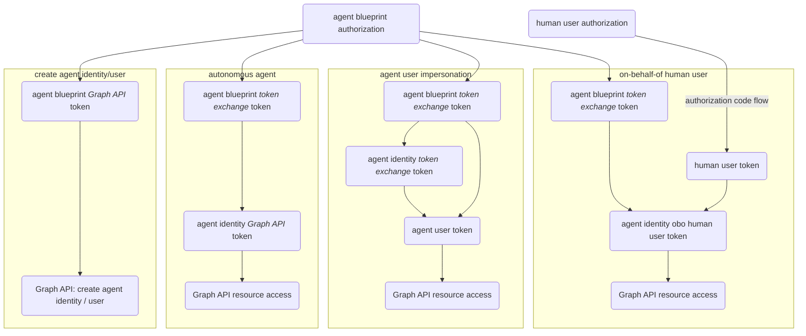

## 1. Entra agent identity authorization flows


```mermaid
flowchart TD
  subgraph on-behalf-of human user
    B4(agent blueprint <i>token exchange</i> token) ---> OBO(agent identity obo human user token)
    HUT(human user token) --> OBO
    OBO --> G4(Graph API resource access)
  end
  subgraph agent user impersonation
    B3(agent blueprint <i>token exchange</i> token) --> I2(agent identity <i>token exchange</i> token)
    I2 --> AU(agent user token)
    B3 --> AU
    AU --> G3(Graph API resource access)
  end
  subgraph autonomous agent
    B2(agent blueprint <i>token exchange</i> token) ---> I1(agent identity <i>Graph API</i> token)
    I1 --> G2(Graph API resource access)
  end
  subgraph create agent identity/user
    B1(agent blueprint <i>Graph API</i> token) ----> G1(Graph API: create agent identity / user)
  end
  HU(human user authorization) -->|authorization code flow| HUT
  HU ~~~ B3
  BP(agent blueprint authorization) --> B1
  BP --> B2
  BP --> B3
  BP --> B4
```

## 2. Get agent blueprint token

### 2.1. Graph API access token

Agent blueprint needs to access Graph API to create agent identity and agent user

The `scope` used in the _access_ token request for Graph API is `https://graph.microsoft.com/.default`

#### 2.1.A. Using client secret

```pwsh
$body=@{
  client_id = $AgentIdBp.id
  client_secret = $AgentIdBpPw.secretText
  grant_type = 'client_credentials'
  scope = 'https://graph.microsoft.com/.default'
}
Invoke-RestMethod $token_endpoint -Method Post -Body $body | Tee-Object -Variable tokenAgentIdBp
$headersAgentIdBp = @{ Authorization='Bearer '+$tokenAgentIdBp.access_token }
```

#### 2.1.B. Using FIC (e.g. using Azure VM to get managed identity token)

##### 2.1.B.1. Get exchange token for MI [ᵈᵒᶜ](https://learn.microsoft.com/en-us/entra/identity/managed-identities-azure-resources/how-to-use-vm-token)

```pwsh
$endpointuri = 'http://169.254.169.254/metadata/identity/oauth2/token?api-version=2018-02-01&resource=api://AzureADTokenExchange'
Invoke-RestMethod $endpointuri -Headers @{Metadata="true"} | Tee-Object -Variable tokenMI
$tokenMI.access_token
```

##### 2.1.B.2. Exchange MI token for agent blueprint token [ᵈᵒᶜ](https://learn.microsoft.com/en-us/entra/agent-id/identity-platform/create-delete-agent-identities#get-an-access-token-using-agent-identity-blueprint)

```pwsh
$body=@{
  client_id = $AgentIdBp.id
  client_assertion_type = 'urn:ietf:params:oauth:client-assertion-type:jwt-bearer'
  client_assertion = $tokenMI.access_token
  grant_type = 'client_credentials'
  scope = 'https://graph.microsoft.com/.default'
}
Invoke-RestMethod $token_endpoint -Method Post -Body $body | Tee-Object -Variable tokenAgentIdBp
$headersAgentIdBp = @{ Authorization='Bearer '+$tokenAgentIdBp.access_token }
```

#### 2.1.1. Example agent blueprint Graph API access token

Notice:
1. `aud`: `https://graph.microsoft.com`
2. `iss`: `https://sts.windows.net/<tenant-id>/`
3. `appid`: `8a22dfd8-f315-4ee1-be84-c5f46a5b0b3c` (agent bluepint object ID)
4. `oid`, `sub`: `12d1b58c-d6e1-4b90-a8de-e8a8cecfb46d` (agent bluepint principal object ID)
5. `roles`: `AgentIdUser.ReadWrite.IdentityParentedBy` + `AgentIdentity.CreateAsManager`

```json
{
  "aud": "https://graph.microsoft.com",
  "iss": "https://sts.windows.net/323626f5-1bfe-48cd-8902-ddfdfd44e1ce/",
  "iat": 1772364461,
  "nbf": 1772364461,
  "exp": 1772368361,
  "aio": "k2ZgYNg2pdm/lHebXKiZEWfd8yZvAA==",
  "app_displayname": "Agent IdBp01",
  "appid": "8a22dfd8-f315-4ee1-be84-c5f46a5b0b3c",
  "appidacr": "1",
  "idp": "https://sts.windows.net/323626f5-1bfe-48cd-8902-ddfdfd44e1ce/",
  "idtyp": "app",
  "oid": "12d1b58c-d6e1-4b90-a8de-e8a8cecfb46d",
  "rh": "1.AWMB9SY2Mv4bzUiJAt39_UThzgMAAAAAAAAAwAAAAAAAAAAAAABjAQ.",
  "roles": [
    "AgentIdUser.ReadWrite.IdentityParentedBy",
    "AgentIdentity.CreateAsManager"
  ],
  "sub": "12d1b58c-d6e1-4b90-a8de-e8a8cecfb46d",
  "tenant_region_scope": "NA",
  "tid": "323626f5-1bfe-48cd-8902-ddfdfd44e1ce",
  "uti": "GQkNlJPZNEqUJ4reXrPGAA",
  "ver": "1.0",
  "wids": [
    "0997a1d0-0d1d-4acb-b408-d5ca73121e90"
  ],
  "xms_acd": 1772364424,
  "xms_act_fct": "9 3",
  "xms_ftd": "aJ0fGVJmcUPAXi_PkddSpAkraCC4y5v3plYyaTDRpYABdXNzb3V0aC1kc21z",
  "xms_idrel": "8 7",
  "xms_rd": "0.42LjYBJieswkJMLBLiQQtXu9kpAqp0cXn4lv9ZfXd4GinEICZQprV61WY_Xc-JqTP6la_DpQlENIgJkBAg5AaaAot5DAwT2Jb16_T91gHB85v-jC4tkA",
  "xms_sub_fct": "9 3",
  "xms_tcdt": 1752658764,
  "xms_tnt_fct": "10 3"
}
```

### 2.2. Token exchange token

Agent blueprint provides the credentials for agent identity and agent user authorization via token exchange

The `scope` used in the _token exchange_ token request for Graph API is `api://AzureADTokenExchange/.default`

#### 2.2.A. Using client secret

```pwsh
$body=@{
  client_id = $AgentIdBp.id
  client_secret = $AgentIdBpPw.secretText
  fmi_path = $AgentId.id
  grant_type = 'client_credentials'
  scope = 'api://AzureADTokenExchange/.default'
}
Invoke-RestMethod $token_endpoint -Method Post -Body $body | Tee-Object -Variable tokenAgentIdBp
```

#### 2.2.B. Using FIC (e.g. using Azure VM to get managed identity token)

##### 2.2.B.1. Get exchange token for MI [ᵈᵒᶜ](https://learn.microsoft.com/en-us/entra/identity/managed-identities-azure-resources/how-to-use-vm-token)

```pwsh
$endpointuri = 'http://169.254.169.254/metadata/identity/oauth2/token?api-version=2018-02-01&resource=api://AzureADTokenExchange'
Invoke-RestMethod $endpointuri -Headers @{Metadata="true"} | Tee-Object -Variable tokenMI
$tokenMI.access_token
```

##### 2.2.B.2. Exchange MI token for agent blueprint token [ᵈᵒᶜ](https://learn.microsoft.com/en-us/entra/agent-id/identity-platform/autonomous-agent-request-tokens#request-a-token-for-the-agent-identity-blueprint)

```pwsh
$body=@{
  client_id = $AgentIdBp.id
  client_assertion_type = 'urn:ietf:params:oauth:client-assertion-type:jwt-bearer'
  client_assertion = $tokenMI.access_token
  fmi_path = $AgentId.id
  grant_type = 'client_credentials'
  scope = 'api://AzureADTokenExchange/.default'
}
Invoke-RestMethod $token_endpoint -Method Post -Body $body | Tee-Object -Variable tokenAgentIdBp
```

#### 2.2.1. Example agent blueprint token exchange token

Notice:
1. `aud`: `fb60f99c-7a34-4190-8149-302f77469936` (AAD token exchange public endpoint)
2. `iss`: `https://login.microsoftonline.com/<tenant-id>/v2.0`
3. `azp` (authorized parties): `8a22dfd8-f315-4ee1-be84-c5f46a5b0b3c` (agent bluepint object ID)
4. `oid`: `12d1b58c-d6e1-4b90-a8de-e8a8cecfb46d` (agent bluepint principal object ID)
5. `sub`: `.../f3526a0b-788e-4f6c-bb3e-9864b45a3074` (agent identity object ID)
6. `roles`: _not present_

```json
{
  "aud": "fb60f99c-7a34-4190-8149-302f77469936",
  "iss": "https://login.microsoftonline.com/323626f5-1bfe-48cd-8902-ddfdfd44e1ce/v2.0",
  "iat": 1772364652,
  "nbf": 1772364652,
  "exp": 1772368552,
  "aio": "k2ZgYHhWX7KPVVRh+ict3rrIfV0t61pnVvtamjge/xeYkdLM8xsA",
  "azp": "8a22dfd8-f315-4ee1-be84-c5f46a5b0b3c",
  "azpacr": "1",
  "idtyp": "app",
  "oid": "12d1b58c-d6e1-4b90-a8de-e8a8cecfb46d",
  "rh": "1.AWMB9SY2Mv4bzUiJAt39_UThzpz5YPs0epBBgUkwL3dGmTYAAABjAQ.",
  "sub": "/eid1/c/pub/t/9SY2Mv4bzUiJAt39_UThzg/a/2N8iihXz4U6-hMX0alsLPA/f3526a0b-788e-4f6c-bb3e-9864b45a3074",
  "tid": "323626f5-1bfe-48cd-8902-ddfdfd44e1ce",
  "uti": "4V2CRJvtF0q2t05mF0gmAA",
  "ver": "2.0",
  "xms_act_fct": "3 9",
  "xms_ficinfo": "CAAQABgAIAAoAjAA",
  "xms_ftd": "EdHbnkq1lfvottB1vCcuOByaFbkZTo0Fl4BLT4HGYsIBdXN3ZXN0My1kc21z",
  "xms_idrel": "7 26",
  "xms_sub_fct": "3 9"
}
```

## 3. Get agent identity token

### 3.1. Graph API access token

Use agent blueprint token to get agent identity _access_ token [ᵈᵒᶜ](https://learn.microsoft.com/en-us/entra/agent-id/identity-platform/autonomous-agent-request-tokens#request-an-agent-identity-token)
> Autonomous agent flow

```pwsh
$body=@{
  client_id = $AgentId.id
  client_assertion_type = 'urn:ietf:params:oauth:client-assertion-type:jwt-bearer'
  client_assertion = $tokenAgentIdBp.access_token
  grant_type = 'client_credentials'
  scope = 'https://graph.microsoft.com/.default'
}
Invoke-RestMethod $token_endpoint -Method Post -Body $body | Tee-Object -Variable tokenAgentIdentity
```

#### 3.1.1. Example agent identity Graph API access token

Notice:
1. `aud`: `https://graph.microsoft.com`
2. `iss`: `https://sts.windows.net/<tenant-id>/`
3. `appid`, `oid`, `sub`: `f3526a0b-788e-4f6c-bb3e-9864b45a3074` (agent identity object ID)
4. `roles`: `SecurityIncident.Read.All` (the agent identity was granted `SecurityIncident.Read.All` application permission)
5. `xms_par_app_azp`: `8a22dfd8-f315-4ee1-be84-c5f46a5b0b3c`  (agent bluepint object ID)

```json
{
  "aud": "https://graph.microsoft.com",
  "iss": "https://sts.windows.net/323626f5-1bfe-48cd-8902-ddfdfd44e1ce/",
  "iat": 1772365320,
  "nbf": 1772365320,
  "exp": 1772369220,
  "aio": "k2ZgYKjf5Zu+4N8tLzd/iXnCdpO2T5zj2mlxI7vH20x6R7EKay0A",
  "app_displayname": "Agent IdBp01 Id01",
  "appid": "f3526a0b-788e-4f6c-bb3e-9864b45a3074",
  "appidacr": "2",
  "idp": "https://sts.windows.net/323626f5-1bfe-48cd-8902-ddfdfd44e1ce/",
  "idtyp": "app",
  "oid": "f3526a0b-788e-4f6c-bb3e-9864b45a3074",
  "rh": "1.AWMB9SY2Mv4bzUiJAt39_UThzgMAAAAAAAAAwAAAAAAAAAAAAABjAQ.",
  "roles": [
    "SecurityIncident.Read.All"
  ],
  "sub": "f3526a0b-788e-4f6c-bb3e-9864b45a3074",
  "tenant_region_scope": "NA",
  "tid": "323626f5-1bfe-48cd-8902-ddfdfd44e1ce",
  "uti": "EigReKRUyEuiPKxpn3NfAQ",
  "ver": "1.0",
  "wids": [
    "0997a1d0-0d1d-4acb-b408-d5ca73121e90"
  ],
  "xms_act_fct": "3 11 9",
  "xms_ftd": "1rxXWn6flFc3gyTXK1CGMR4BsEgPCD5eSV9sFK8aX00BdXNlYXN0LWRzbXM",
  "xms_idrel": "28 7",
  "xms_par_app_azp": "8a22dfd8-f315-4ee1-be84-c5f46a5b0b3c",
  "xms_rd": "0.42LjYBJieswkJMLBLiSwNTxtx4n9Ck5LVBq3Lct8Ug4U5RQSKFNYu2q1Gqvnxtec_EnV4teBohxCAswMEHAASgNFuYUE7nFxTJr__ek1Tul523TXBCdK8XFwCXEZmpsbGZuZGhibAwA",
  "xms_sub_fct": "11 3 9",
  "xms_tcdt": 1752658764,
  "xms_tnt_fct": "14 3"
}
```

### 3.2. Token exchange token

Use agent blueprint token to get agent identity _token exchange_ token [ᵈᵒᶜ](https://learn.microsoft.com/en-us/entra/agent-id/identity-platform/autonomous-agent-request-agent-user-tokens#request-agent-user-token)
> Agent user impersonation flow

```pwsh
$body=@{
  client_id = $AgentId.id
  client_assertion_type = 'urn:ietf:params:oauth:client-assertion-type:jwt-bearer'
  client_assertion = $tokenAgentIdBp.access_token
  grant_type = 'client_credentials'
  scope = 'api://AzureADTokenExchange/.default'
}
Invoke-RestMethod $token_endpoint -Method Post -Body $body | Tee-Object -Variable tokenAgentIdentity
```

#### 3.2.1. Example agent identity token exchange token

Notice:
1. `aud`: `fb60f99c-7a34-4190-8149-302f77469936` (AAD token exchange public endpoint)
2. `iss`: `https://login.microsoftonline.com/<tenant-id>/v2.0`
3. `azp`, `oid`, `sub`: `f3526a0b-788e-4f6c-bb3e-9864b45a3074` (agent identity object ID)
4. `roles`: _not present_
5. `xms_par_app_azp`: `8a22dfd8-f315-4ee1-be84-c5f46a5b0b3c`  (agent bluepint object ID)

```json
{
  "aud": "fb60f99c-7a34-4190-8149-302f77469936",
  "iss": "https://login.microsoftonline.com/323626f5-1bfe-48cd-8902-ddfdfd44e1ce/v2.0",
  "iat": 1772365317,
  "nbf": 1772365317,
  "exp": 1772369217,
  "aio": "k2ZgYFjYop6SYfqv/tW0G7wVWk2OjyMsp117GXV+Sru5oqelUTsA",
  "azp": "f3526a0b-788e-4f6c-bb3e-9864b45a3074",
  "azpacr": "2",
  "idtyp": "app",
  "oid": "f3526a0b-788e-4f6c-bb3e-9864b45a3074",
  "rh": "1.AWMB9SY2Mv4bzUiJAt39_UThzpz5YPs0epBBgUkwL3dGmTYAAABjAQ.",
  "sub": "f3526a0b-788e-4f6c-bb3e-9864b45a3074",
  "tid": "323626f5-1bfe-48cd-8902-ddfdfd44e1ce",
  "uti": "xWGr77lq1kWN9vKZRuqTAA",
  "ver": "2.0",
  "xms_act_fct": "3 9 11",
  "xms_ficinfo": "CAAQABgAIAAoAzAAOAE",
  "xms_ftd": "iHm9KmDUUtHxmaXdHy2fajcso_dQ8UILkB_0Md3Zq3kBdXNzb3V0aC1kc21z",
  "xms_idrel": "14 7",
  "xms_par_app_azp": "8a22dfd8-f315-4ee1-be84-c5f46a5b0b3c",
  "xms_sub_fct": "9 3 11"
}
```

## 4. Get agent user token

Use agent identity _token exchange_ token to get agent user token [ᵈᵒᶜ](https://learn.microsoft.com/en-us/entra/agent-id/identity-platform/autonomous-agent-request-agent-user-tokens#request-agent-user-token)
> Agent user impersonation flow

```pwsh
$body=@{
  client_id = $AgentId.id
  client_assertion_type = 'urn:ietf:params:oauth:client-assertion-type:jwt-bearer'
  client_assertion = $tokenAgentIdBp.access_token
  user_id = $AgentUser.id
  user_federated_identity_credential = $tokenAgentIdentity.access_token
  grant_type = 'user_fic'
  scope = 'https://graph.microsoft.com/.default'
}
Invoke-RestMethod $token_endpoint -Method Post -Body $body | Tee-Object -Variable tokenAgentUser
```

### 4.1. Example agent user Graph API access token

Notice:
1. `aud`: `https://graph.microsoft.com`
2. `iss`: `https://sts.windows.net/<tenant-id>/`
3. `appid`: `f3526a0b-788e-4f6c-bb3e-9864b45a3074` (agent identity object ID)
4. `oid`: `956d09a9-5f97-458c-a410-417be7449d04` (agent user object ID)
5. `scp`: includes `SecurityIncident.Read.All`
    1. The agent identity was granted delegated permission  to perform `SecurityIncident.Read.All` on behalf of agent user
    2. `scp` means delegated permissions
6. `idtyp`: `user`
7. `xms_par_app_azp`: `8a22dfd8-f315-4ee1-be84-c5f46a5b0b3c`  (agent bluepint object ID)

```json
{
  "aud": "https://graph.microsoft.com",
  "iss": "https://sts.windows.net/323626f5-1bfe-48cd-8902-ddfdfd44e1ce/",
  "iat": 1772365495,
  "nbf": 1772365495,
  "exp": 1772369618,
  "acct": 0,
  "acr": "0",
  "acrs": [
    "p1",
    "urn:user:registersecurityinfo"
  ],
  "aio": "AbQAS/8bAAAA/B30GZhgT6AivCNYiYAmD9OvoMQH+VKqp5ZgV31D5bMkZFff4SNPBBfgKdvO+dc7ZFHIwgi9MC7SYWoz21HCXJHjfuRuzMaqbKQ6HYZwsw7bzUbXLbUBmjVOCUILqbEnhlfYxAfxMbMDoF8ezl31r7m0OTav00wZFypp18ZvwjCJpv6+8E5OXgWLXOJeFaeenZYB+XPk9Cik6jRtcMNpVhSkgkOEbThybckGjhp+/oM=",
  "app_displayname": "Agent IdBp01 Id01",
  "appid": "f3526a0b-788e-4f6c-bb3e-9864b45a3074",
  "appidacr": "2",
  "idtyp": "user",
  "ipaddr": "175.156.74.57",
  "name": "Agent IdBp01 Id01 User01",
  "oid": "956d09a9-5f97-458c-a410-417be7449d04",
  "platf": "3",
  "puid": "10032005A4F00AF8",
  "rh": "1.AWMB9SY2Mv4bzUiJAt39_UThzgMAAAAAAAAAwAAAAAAAAAAAAEBjAQ.",
  "scp": "SecurityIncident.Read.All profile openid email",
  "sid": "002df5ba-69f5-fbdf-7bc6-7f3a7d821e02",
  "sub": "jDRooRkrHByXnyz-djw0WZ1fTKZRhG6ZnEYNuJ3VRKE",
  "tenant_region_scope": "NA",
  "tid": "323626f5-1bfe-48cd-8902-ddfdfd44e1ce",
  "unique_name": "agent-idbp01-id01-user01@MngEnvMCAP398230.onmicrosoft.com",
  "upn": "agent-idbp01-id01-user01@MngEnvMCAP398230.onmicrosoft.com",
  "uti": "IFAI1eh4QkelZ35TgjMMAA",
  "ver": "1.0",
  "wids": [
    "b79fbf4d-3ef9-4689-8143-76b194e85509"
  ],
  "xms_act_fct": "3 11 9",
  "xms_ftd": "ZTvHG9VYzr3gaKZvdiMi8utx0T3IFV0zRMmQGSTVwrwBdXNzb3V0aC1kc21z",
  "xms_idrel": "1 32",
  "xms_par_app_azp": "8a22dfd8-f315-4ee1-be84-c5f46a5b0b3c",
  "xms_st": {
    "sub": "2-wfJ3s-tc6OrgXFUvg50tiTrLHq9c2sJ8CorU0xTak"
  },
  "xms_sub_fct": "3 13",
  "xms_tcdt": 1752658764,
  "xms_tnt_fct": "3 6"
}
```
