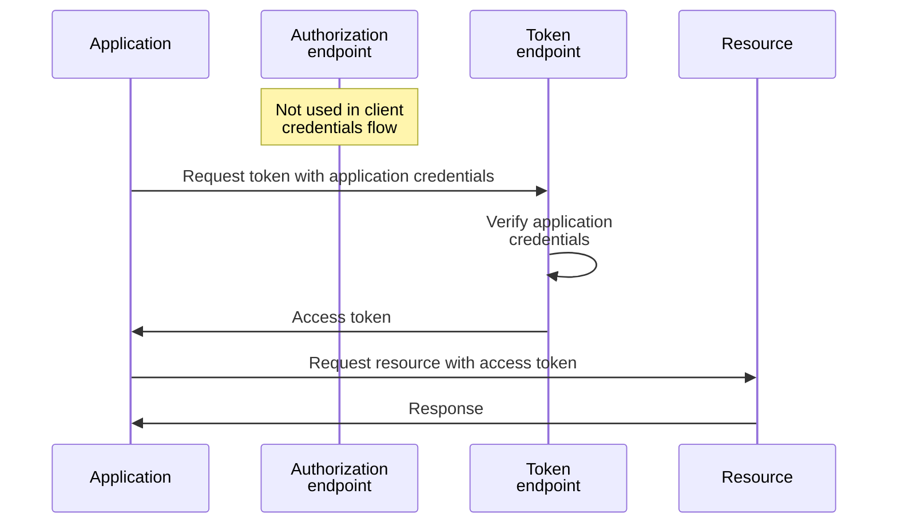
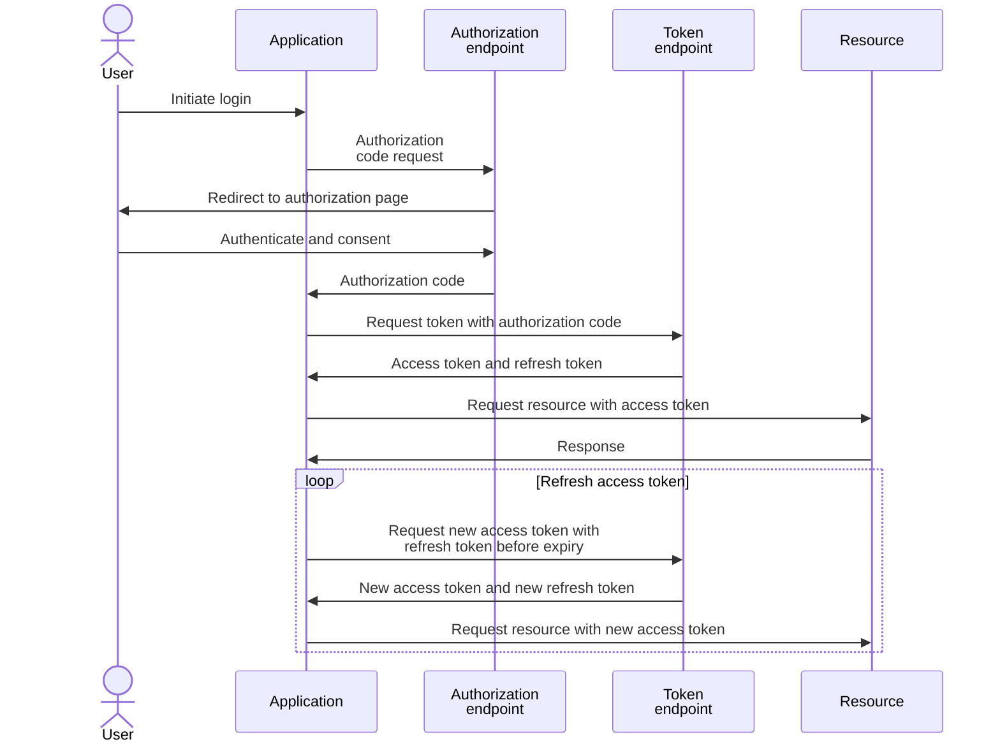
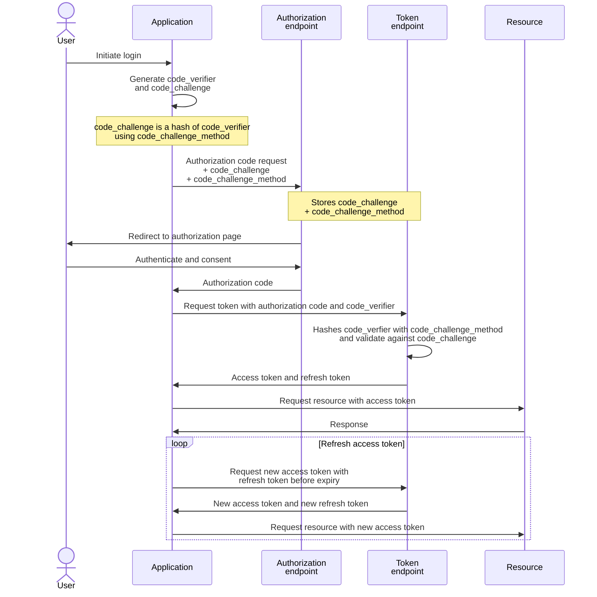

## 1. Client credential flow

[Entra client credential flow](https://learn.microsoft.com/en-us/entra/identity-platform/v2-oauth2-client-creds-grant-flow) follows section `4.4. Client Credentials Grant` of [RFC 6749 OAuth 2.0 Authorization Framework](https://datatracker.ietf.org/doc/html/rfc6749) and works with:
1. Client secret: section `2.3.1. Client Password` of RFC 6749
2. Client assertion (signed with application certificate): uses `client_assertion_type` of `urn:ietf:params:oauth:client-assertion-type:jwt-bearer` from section `2.2. Using JWTs for Client Authentication` of [RFC 7523 - JSON Web Token (JWT) Profile for OAuth 2.0 Client Authentication and Authorization Grants](https://datatracker.ietf.org/doc/html/rfc7523)

The [Entra on-behalf-of flow](https://learn.microsoft.com/en-us/entra/identity-platform/v2-oauth2-on-behalf-of-flow) is based on [RFC 7523 - JSON Web Token (JWT) Profile for OAuth 2.0 Client Authentication and Authorization Grants](https://datatracker.ietf.org/doc/html/rfc7523):
- `urn:ietf:params:oauth:grant-type:jwt-bearer`
- `urn:ietf:params:oauth:client-assertion-type:jwt-bearer`

## 2. Authorization code flow

[Entra authorization code flow](https://learn.microsoft.com/en-us/entra/identity-platform/v2-oauth2-auth-code-flow) follows section `4.1. Authorization Code Grant` of [RFC 6749 OAuth 2.0 Authorization Framework](https://datatracker.ietf.org/doc/html/rfc6749)

### 2.1. without Proof Key for Code Exchange (PKCE)

### 2.2. with Proof Key for Code Exchange (PKCE)

[RFC 7636 - Proof Key for Code Exchange by OAuth Public Clients](https://datatracker.ietf.org/doc/html/rfc7636)

## 3. On-behalf-of flow

[Entra on-behalf-of flow](https://learn.microsoft.com/en-us/entra/identity-platform/v2-oauth2-on-behalf-of-flow) comprises of:
1. User sign-in to client application via authorization code flow to get client application token
2. Client application token is then used to get middle-tier application token with `grant_type` of `urn:ietf:params:oauth:grant-type:jwt-bearer` from section `2.1. Using JWTs as Authorization Grants` of [RFC 7523 - JSON Web Token (JWT) Profile for OAuth 2.0 Client Authentication and Authorization Grants](https://datatracker.ietf.org/doc/html/rfc7523)

```mermaid
sequenceDiagram
  actor A as User
  participant B as Application<br>(client)
  participant C as Authorization<br>endpoint
  participant D as Token<br>endpoint
  participant E as Application<br>(middle-tier)
  participant F as Resource
  rect rgb(32, 32, 32)
    note over A,D:Authorization code flow
    A->>B:Initiate login
    B->>C:Authorization<br>code request
    C->>A:Redirect to authorization page
    A->>C:Authenticate and consent
    C->>B:Authorization code
    B->>D:Request token (client) with authorization code
    D->>B:Token (client)
  end
  rect rgb(32, 32, 32)
    note over B,E:On-behalf-of flow
    B->>E:Send token (client) to middle-tier app
    E->>D:Request token (resource)<br>with token (client)
    E->>B:Return token (resource)
  end
  E->>F:Request resource<br>with token (resource)
  F->>E:Response
```

## 4. Federated identity credentials (FIC)

Entra doesn't implement the [RFC 8693 - OAuth 2.0 Token Exchange](https://datatracker.ietf.org/doc/html/rfc8693) (`urn:ietf:params:oauth:grant-type:token-exchange`)

The Entra workload identity / FIC is a customized implementation (`aud`: `api://AzureADTokenExchange`)
- https://learn.microsoft.com/en-us/graph/api/resources/federatedidentitycredentials-overview
- https://learn.microsoft.com/en-us/entra/workload-id/workload-identity-federation-create-trust
