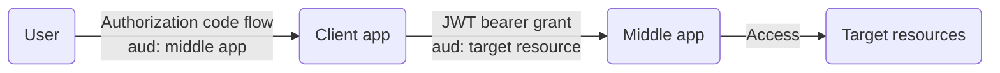

## 0. Example applications configurations



[Entra on-behalf-of flow](https://learn.microsoft.com/en-us/entra/identity-platform/v2-oauth2-on-behalf-of-flow) comprises of:
1. User sign-in to client application via _authorization code flow_ to get client application token
2. Client application token is then used to get middle-tier application token with `grant_type` of `urn:ietf:params:oauth:grant-type:jwt-bearer` from section `2.1. Using JWTs as Authorization Grants` of [RFC 7523 - JSON Web Token (JWT) Profile for OAuth 2.0 Client Authentication and Authorization Grants](https://datatracker.ietf.org/doc/html/rfc7523)

### 0.1. Middle app

The middle app holds the actual delegated permissions required to access the target resources (permissions for Microsoft Graph Security APIs shown):


The middle app must be exposed as an API with a specified scope name for the client app to access:


> [!Note]
>
> The respective `display name` and `description` for `Admin` and `User` consents are presented to the user when listing the permissions requested during authorization code flow
>
> Give a meaningful name and description so that the user can understand what is granted
> 
> 

### 0.2. Client app

The middle app's exposed API is then visible under `My APIs` to be added to the client app's API permissions:


## 1. Authorization code flow

> [!Tip]
>
> This write-up uses PowerShell method to capture the authroziation code
>
> Postman can be used to simplify the request and browser interaction as written [here](https://github.com/joetanx/mslab/blob/main/entra/flows/authorization-code.md)

### 1.1. Setup listener to capture authorization code

Run PowerShell **as administrator** and stage the tenant and application IDs:

```pwsh
$tenant = '323626f5-1bfe-48cd-8902-ddfdfd44e1ce'
$clientappid='629f37fd-84c5-411c-b04d-a0ffb3ef56a1'
$clientappsecret='<client-app-secret>'
$middleappid='05417710-613b-483c-a5d6-f7a4120da964'
$middleappsecret='<middle-app-secret>'
$middleappscopename='access'
```

Start the HTTP listener: it will block until the redirect from the authorization code flow is received, then capture the `code` and respond to the browser

```pwsh
$listener = [System.Net.HttpListener]::new()
$listener.Prefixes.Add('http://localhost/')
$listener.Start()
$context = $listener.GetContext()
$request = $context.Request
$code = $request.QueryString['code']
# respond to browser
$response = $context.Response
$html = "<html><body>Login has completed. This window can be closed.</body></html>"
$buffer = [System.Text.Encoding]::UTF8.GetBytes($html)
$response.ContentLength64 = $buffer.Length
$response.OutputStream.Write($buffer, 0, $buffer.Length)
$response.OutputStream.Close()
$listener.Stop()
```

### 1.2. Trigger authorization code request with client app

Open a **separate** PowerShell (the listener terminal is still blocked waiting for the redirect) and also stage the tenant and application IDs in this terminal

Construct the authorization URL and open it in the browser:

```pwsh
$redirect_uri = 'http://localhost'
$state = [guid]::NewGuid().ToString()
$auth_url = "https://login.microsoftonline.com/$tenant/oauth2/v2.0/authorize" +
  "?client_id=$clientappid" +
  "&redirect_uri=$([uri]::EscapeDataString($redirect_uri))" +
  "&response_type=code" +
  "&response_mode=query" +
  "&scope=$([uri]::EscapeDataString("api://$middleappid/$middleappscopename"))" +
  "&state=$state"
Start-Process $auth_url
```

### 1.3. Authorize permissions requested

The opened browser request lists the middle app (with the display name and description configured in the API scope)


Upon accept, the code is sent to the listener terminal, which responds with `Login has completed. This window can be closed.`:


The client enterprise application object lists all user granted permissions:


To remove user granted permission, go to User object → Applications → Select application → Remove:


### 1.4. Redeem authorization code flow for client app token

Switch back to the **listener terminal** (which now has `$code` populated)

The scope requested here matches what was used in the authorization URL:

```pwsh
$token_endpoint = "https://login.microsoftonline.com/$tenant/oauth2/v2.0/token"
$body = @{
  client_id     = $clientappid
  client_secret = $clientappsecret
  scope         = "api://$middleappid/$middleappscopename"
  code          = $code
  redirect_uri  = 'http://localhost'
  grant_type    = 'authorization_code'
}
Invoke-RestMethod $token_endpoint -Method Post -Body $body | Tee-Object -Variable clientapptoken
```

The resulting `access_token` (decoded) has `aud` set to the middle app's application ID URI and `scp` set to the scope name exposed by the middle app:

```json
{
  "aud": "api://05417710-613b-483c-a5d6-f7a4120da964",
  "iss": "https://sts.windows.net/323626f5-1bfe-48cd-8902-ddfdfd44e1ce/",
  "iat": 1779062556,
  "nbf": 1779062556,
  "exp": 1779068202,
  "acr": "1",
  "aio": "AZQAa/8cAAAAYoxhWVZMRsiWkS/T7QN+eNzpM+2pwcpKan/xsGmZ8agYk/vxpiG/iT+pJHAMdn5HhRVByWL27u1C0amvN7WmJUXjMVGOF1sKYLyKRUSV6bgX7R50bfbaV31ru+v/fihW7+i7tppwea5uHLUw/ip7B0INCVFTYK9+zFO+aLiQbGKQyXlsl1sSvjK9/IimuzDp",
  "amr": [
    "pwd",
    "mfa"
  ],
  "appid": "629f37fd-84c5-411c-b04d-a0ffb3ef56a1",
  "appidacr": "1",
  "family_name": "Administrator",
  "given_name": "System",
  "ipaddr": "175.156.72.120",
  "name": "System Administrator",
  "oid": "38acbfa6-2f1f-46c1-a0ca-a4cf4eb6d55e",
  "rh": "1.AWMB9SY2Mv4bzUiJAt39_UThzhB3QQU7YTxIpdb3pBINqWQAALtjAQ.",
  "scp": "access",
  "sid": "004dd9ca-7ceb-cd96-5c0a-a8bca2c0c706",
  "sub": "HkG_Q72XzGnZwGG48RkR0vtWboYx3jYZqT7nbM1L1Dk",
  "tid": "323626f5-1bfe-48cd-8902-ddfdfd44e1ce",
  "unique_name": "admin@MngEnvMCAP398230.onmicrosoft.com",
  "upn": "admin@MngEnvMCAP398230.onmicrosoft.com",
  "uti": "fUhpqjW7KEmuIqkhTwCIAA",
  "ver": "1.0",
  "xms_ftd": "zc2jyt1D027H2PMinxjCneS31T8-EZc90Y36HFekUw8BdXNub3J0aC1kc21z"
}
```

## 2. Exchange client app token for middle app token

Use the client app's `access_token` as the `assertion` in a JWT-bearer grant to the token endpoint

(still in the listener terminal which has the client-app token)

The middle app authenticates with its own credentials and requests the delegated permissions it holds (`https://graph.microsoft.com/.default`):

```pwsh
$body = @{
  client_id           = $middleappid
  client_secret       = $middleappsecret
  scope               = 'https://graph.microsoft.com/.default'
  assertion           = $clientapptoken.access_token
  grant_type          = 'urn:ietf:params:oauth:grant-type:jwt-bearer'
  requested_token_use = 'on_behalf_of'
}
Invoke-RestMethod $token_endpoint -Method Post -Body $body | Tee-Object -Variable token
$headers = @{ Authorization = 'Bearer ' + $token.access_token }
```

The resulting `access_token` (decoded) now has `aud` set to `https://graph.microsoft.com` and `scp` reflecting the Graph permissions delegated to the middle app:

```json
{
  "aud": "https://graph.microsoft.com",
  "iss": "https://sts.windows.net/323626f5-1bfe-48cd-8902-ddfdfd44e1ce/",
  "iat": 1779062576,
  "nbf": 1779062576,
  "exp": 1779066490,
  "acct": 0,
  "acr": "1",
  "acrs": [
    "p1"
  ],
  "aio": "AcQAO/8cAAAAeWQ0tvL9HaypLcliYpMD42hroEYOvbm6MH0kFWGcgxk28EVeO6f8mWE7P2qCt6C2lyooIp6Gl5Zos6C8uyh+maegNHqCH9hBg0fsAh+dOFZ9xUgFqE/gASgjh5ydeKLkRhFurJ9WB8a9DF9GaRAYh0k9pEwe4e7t7resN6qjLBT37fNHtbkYzkmyrPp7isJAMwMxXWXt0+X1HIzXSxk/DmdoWJrNIonSnEwYyp0FRejP4GmWMETRqmmW67UHCa4E",
  "amr": [
    "pwd",
    "mfa"
  ],
  "app_displayname": "obo-middle-app",
  "appid": "05417710-613b-483c-a5d6-f7a4120da964",
  "appidacr": "1",
  "family_name": "Administrator",
  "given_name": "System",
  "idtyp": "user",
  "ipaddr": "175.156.72.120",
  "name": "System Administrator",
  "oid": "38acbfa6-2f1f-46c1-a0ca-a4cf4eb6d55e",
  "platf": "3",
  "puid": "10032004E18EB399",
  "rh": "1.AWMB9SY2Mv4bzUiJAt39_UThzgMAAAAAAAAAwAAAAAAAAAAAALtjAQ.",
  "scp": "SecurityAlert.Read.All SecurityIncident.Read.All ThreatHunting.Read.All profile openid email",
  "sid": "004dd9ca-7ceb-cd96-5c0a-a8bca2c0c706",
  "sub": "o-YHRzN55wxQ5HolG1SS2jCEYS-30KeFqtVlJDH45UQ",
  "tenant_region_scope": "NA",
  "tid": "323626f5-1bfe-48cd-8902-ddfdfd44e1ce",
  "unique_name": "admin@MngEnvMCAP398230.onmicrosoft.com",
  "upn": "admin@MngEnvMCAP398230.onmicrosoft.com",
  "uti": "A36ReTUXbEy7KP_pSQKVAA",
  "ver": "1.0",
  "wids": [
    "f2ef992c-3afb-46b9-b7cf-a126ee74c451",
    "194ae4cb-b126-40b2-bd5b-6091b380977d",
    "b79fbf4d-3ef9-4689-8143-76b194e85509"
  ],
  "xms_acd": 1771468171,
  "xms_act_fct": "3 9",
  "xms_ftd": "p3pDkzwyiL-HBfQMX9vGIAoFp2wBZvapnTlsiuj0WpwBdXNub3J0aC1kc21z",
  "xms_idrel": "1 16",
  "xms_pftexp": 1779152890,
  "xms_st": {
    "sub": "HkG_Q72XzGnZwGG48RkR0vtWboYx3jYZqT7nbM1L1Dk"
  },
  "xms_sub_fct": "3 6",
  "xms_tcdt": 1752658764,
  "xms_tnt_fct": "3 16"
}
```

## 3. Troubleshooting

### 3.1. on-behalf-of flow doesn't work to chain app token to another app

```json
{
  "error": "unauthorized_client",
  "error_description": "AADSTS7000114: Application '05417710-613b-483c-a5d6-f7a4120da964' is not allowed to make application on-behalf-of calls. Trace ID:9acd713c-b1ef-434e-80cb-f3fceac16f00 Correlation ID: e6d29475-c298-4ca1-bdb2-ac7656ed5df3 Timestamp: 2026-02-1907:34:48Z",
  "error_codes": [
    7000114
  ],
  "timestamp": "2026-02-19 07:34:48Z",
  "trace_id": "9acd713c-b1ef-434e-80cb-f3fceac16f00",
  "correlation_id": "e6d29475-c298-4ca1-bdb2-ac7656ed5df3",
  "error_uri": "https://login.microsoftonline.com/error?code=7000114"
}
```

### 3.2. possible bad configurations

Parse errors presented in URLs with: https://www.freeformatter.com/url-parser-query-string-splitter.html

#### 3.2.1. Middle app doesn't exist or API not exposed

Raw error:

```url
http://localhost/?error=invalid_resource&error_description=AADSTS500011%3a+The+resource+principal+named+api%3a%2f%2f05417710-613b-483c-a5d6-f7a4120da964+was+not+found+in+the+tenant+named+Contoso.+This+can+happen+if+the+application+has+not+been+installed+by+the+administrator+of+the+tenant+or+consented+to+by+any+user+in+the+tenant.+You+might+have+sent+your+authentication+request+to+the+wrong+tenant.+Trace+ID%3a+712f08aa-0375-46de-9c23-bfa11f462600+Correlation+ID%3a+57946413-c07c-4507-a9cc-399ebfd01bd9+Timestamp%3a+2026-02-19+02%3a42%3a55Z&error_uri=https%3a%2f%2flogin.microsoftonline.com%2ferror%3fcode%3d500011&state=3400de10-9b9f-42a3-afab-507f2033383f#
```

```yaml
'error':	invalid_resource
'error_description':	AADSTS500011: The resource principal named api://05417710-613b-483c-a5d6-f7a4120da964 was not found in the tenant named Contoso. This can happen if the application has not been installed by the administrator of the tenant or consented to by any user in the tenant. You might have sent your authentication request to the wrong tenant. Trace ID: 712f08aa-0375-46de-9c23-bfa11f462600 Correlation ID: 57946413-c07c-4507-a9cc-399ebfd01bd9 Timestamp: 2026-02-19 02:42:55Z
```

#### 3.2.2. Client app doesn't have permissions to middle app

Raw error:

```url
http://localhost/?error=invalid_client&error_description=AADSTS650057%3a+Invalid+resource.+The+client+has+requested+access+to+a+resource+which+is+not+listed+in+the+requested+permissions+in+the+client%27s+application+registration.+Client+app+ID%3a+629f37fd-84c5-411c-b04d-a0ffb3ef56a1(obo-client-app).+Resource+value+from+request%3a+api%3a%2f%2f05417710-613b-483c-a5d6-f7a4120da964.+Resource+app+ID%3a+05417710-613b-483c-a5d6-f7a4120da964.+List+of+valid+resources+from+app+registration%3a+00000003-0000-0000-c000-000000000000.+Trace+ID%3a+d72c1f9b-ecb0-478c-a353-8fdbc1159c00+Correlation+ID%3a+6fbb353e-da38-4b18-9d46-98a33184455d+Timestamp%3a+2026-02-19+02%3a44%3a13Z&state=f45ed4c9-effb-4f82-86bc-390cc9b2099e#
```

```yaml
'error':	invalid_client
'error_description':	AADSTS650057: Invalid resource. The client has requested access to a resource which is not listed in the requested permissions in the client's application registration. Client app ID: 629f37fd-84c5-411c-b04d-a0ffb3ef56a1(obo-client-app). Resource value from request: api://05417710-613b-483c-a5d6-f7a4120da964. Resource app ID: 05417710-613b-483c-a5d6-f7a4120da964. List of valid resources from app registration: 00000003-0000-0000-c000-000000000000. Trace ID: d72c1f9b-ecb0-478c-a353-8fdbc1159c00 Correlation ID: 6fbb353e-da38-4b18-9d46-98a33184455d Timestamp: 2026-02-19 02:44:13Z
```
