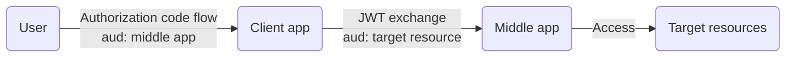

## 0. Example applications configurations



[Entra on-behalf-of flow](https://learn.microsoft.com/en-us/entra/identity-platform/v2-oauth2-on-behalf-of-flow) comprises of:
1. User sign-in to client application via _authorization code flow_ to get client application token
2. Client application token is then used to get middle-tier application token with `grant_type` of `urn:ietf:params:oauth:grant-type:jwt-bearer` from section `2.1. Using JWTs as Authorization Grants` of [RFC 7523 - JSON Web Token (JWT) Profile for OAuth 2.0 Client Authentication and Authorization Grants](https://datatracker.ietf.org/doc/html/rfc7523)

### 0.1. Middle app

The middle app holds the actual delegated permissions required to access the target resources (permissions for Microsoft Graph Security APIs shown):


The middle app must be exposed as an API with a specified scope name for the client app to access:


> [!Note]
>
> The respective `display name` and `description` for `Admin` and `User` consents are presented to the user when listing the permissions requested during authorization code flow
>
> Give a meaningful name and description so that the user can understand what is granted
> 
> 

### 0.2. Client app

The middle app's exposed API is then visible under `My APIs` to be added to the client app's API permissions:


## 1. Authorization code flow

### 1.1. Setup listener to capture authorization code

### 1.2. Trigger authorization code request with client app

### 1.3. Authorize permissions requested


The client enterprise application object lists all user granted permissions:


To remove user granted permission, go to User object → Applications → Select application → Remove:


### 1.4. Redeem authorization code flow for client app token

```json
{
  "aud": "api://05417710-613b-483c-a5d6-f7a4120da964",
  "iss": "https://sts.windows.net/323626f5-1bfe-48cd-8902-ddfdfd44e1ce/",
  "iat": 1779062556,
  "nbf": 1779062556,
  "exp": 1779068202,
  "acr": "1",
  "aio": "AZQAa/8cAAAAYoxhWVZMRsiWkS/T7QN+eNzpM+2pwcpKan/xsGmZ8agYk/vxpiG/iT+pJHAMdn5HhRVByWL27u1C0amvN7WmJUXjMVGOF1sKYLyKRUSV6bgX7R50bfbaV31ru+v/fihW7+i7tppwea5uHLUw/ip7B0INCVFTYK9+zFO+aLiQbGKQyXlsl1sSvjK9/IimuzDp",
  "amr": [
    "pwd",
    "mfa"
  ],
  "appid": "629f37fd-84c5-411c-b04d-a0ffb3ef56a1",
  "appidacr": "1",
  "family_name": "Administrator",
  "given_name": "System",
  "ipaddr": "175.156.72.120",
  "name": "System Administrator",
  "oid": "38acbfa6-2f1f-46c1-a0ca-a4cf4eb6d55e",
  "rh": "1.AWMB9SY2Mv4bzUiJAt39_UThzhB3QQU7YTxIpdb3pBINqWQAALtjAQ.",
  "scp": "access",
  "sid": "004dd9ca-7ceb-cd96-5c0a-a8bca2c0c706",
  "sub": "HkG_Q72XzGnZwGG48RkR0vtWboYx3jYZqT7nbM1L1Dk",
  "tid": "323626f5-1bfe-48cd-8902-ddfdfd44e1ce",
  "unique_name": "admin@MngEnvMCAP398230.onmicrosoft.com",
  "upn": "admin@MngEnvMCAP398230.onmicrosoft.com",
  "uti": "fUhpqjW7KEmuIqkhTwCIAA",
  "ver": "1.0",
  "xms_ftd": "zc2jyt1D027H2PMinxjCneS31T8-EZc90Y36HFekUw8BdXNub3J0aC1kc21z"
}
```

## 2. Exchange client app token for middle app token

```json
{
  "aud": "https://graph.microsoft.com",
  "iss": "https://sts.windows.net/323626f5-1bfe-48cd-8902-ddfdfd44e1ce/",
  "iat": 1779062576,
  "nbf": 1779062576,
  "exp": 1779066490,
  "acct": 0,
  "acr": "1",
  "acrs": [
    "p1"
  ],
  "aio": "AcQAO/8cAAAAeWQ0tvL9HaypLcliYpMD42hroEYOvbm6MH0kFWGcgxk28EVeO6f8mWE7P2qCt6C2lyooIp6Gl5Zos6C8uyh+maegNHqCH9hBg0fsAh+dOFZ9xUgFqE/gASgjh5ydeKLkRhFurJ9WB8a9DF9GaRAYh0k9pEwe4e7t7resN6qjLBT37fNHtbkYzkmyrPp7isJAMwMxXWXt0+X1HIzXSxk/DmdoWJrNIonSnEwYyp0FRejP4GmWMETRqmmW67UHCa4E",
  "amr": [
    "pwd",
    "mfa"
  ],
  "app_displayname": "obo-middle-app",
  "appid": "05417710-613b-483c-a5d6-f7a4120da964",
  "appidacr": "1",
  "family_name": "Administrator",
  "given_name": "System",
  "idtyp": "user",
  "ipaddr": "175.156.72.120",
  "name": "System Administrator",
  "oid": "38acbfa6-2f1f-46c1-a0ca-a4cf4eb6d55e",
  "platf": "3",
  "puid": "10032004E18EB399",
  "rh": "1.AWMB9SY2Mv4bzUiJAt39_UThzgMAAAAAAAAAwAAAAAAAAAAAALtjAQ.",
  "scp": "SecurityAlert.Read.All SecurityIncident.Read.All ThreatHunting.Read.All profile openid email",
  "sid": "004dd9ca-7ceb-cd96-5c0a-a8bca2c0c706",
  "sub": "o-YHRzN55wxQ5HolG1SS2jCEYS-30KeFqtVlJDH45UQ",
  "tenant_region_scope": "NA",
  "tid": "323626f5-1bfe-48cd-8902-ddfdfd44e1ce",
  "unique_name": "admin@MngEnvMCAP398230.onmicrosoft.com",
  "upn": "admin@MngEnvMCAP398230.onmicrosoft.com",
  "uti": "A36ReTUXbEy7KP_pSQKVAA",
  "ver": "1.0",
  "wids": [
    "f2ef992c-3afb-46b9-b7cf-a126ee74c451",
    "194ae4cb-b126-40b2-bd5b-6091b380977d",
    "b79fbf4d-3ef9-4689-8143-76b194e85509"
  ],
  "xms_acd": 1771468171,
  "xms_act_fct": "3 9",
  "xms_ftd": "p3pDkzwyiL-HBfQMX9vGIAoFp2wBZvapnTlsiuj0WpwBdXNub3J0aC1kc21z",
  "xms_idrel": "1 16",
  "xms_pftexp": 1779152890,
  "xms_st": {
    "sub": "HkG_Q72XzGnZwGG48RkR0vtWboYx3jYZqT7nbM1L1Dk"
  },
  "xms_sub_fct": "3 6",
  "xms_tcdt": 1752658764,
  "xms_tnt_fct": "3 16"
}
```
