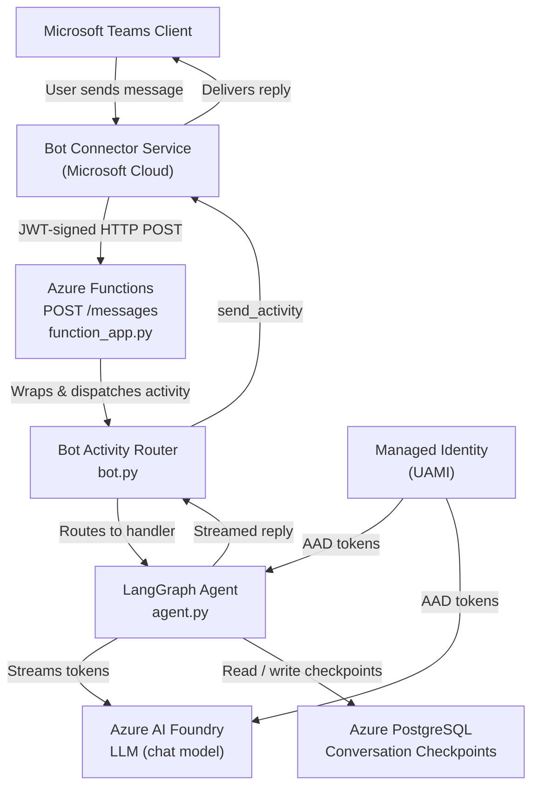
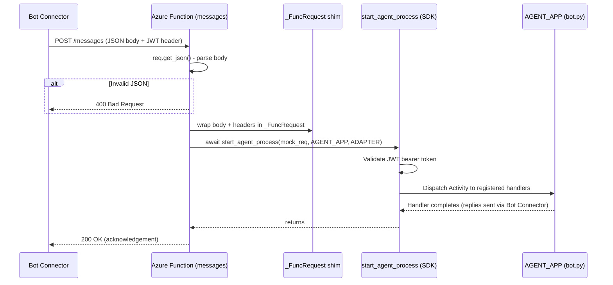
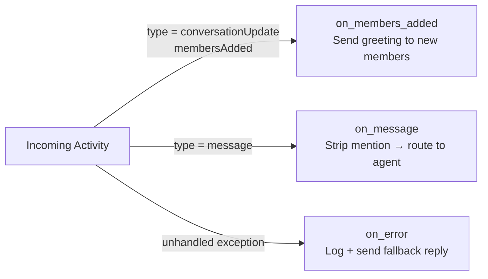
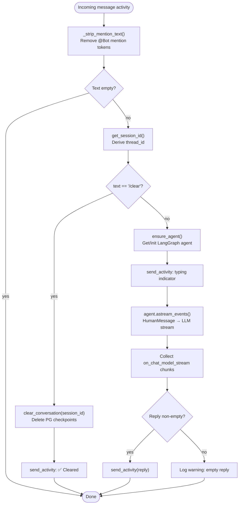
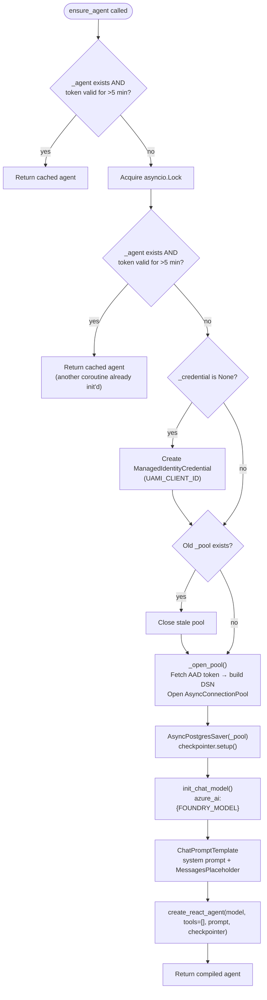
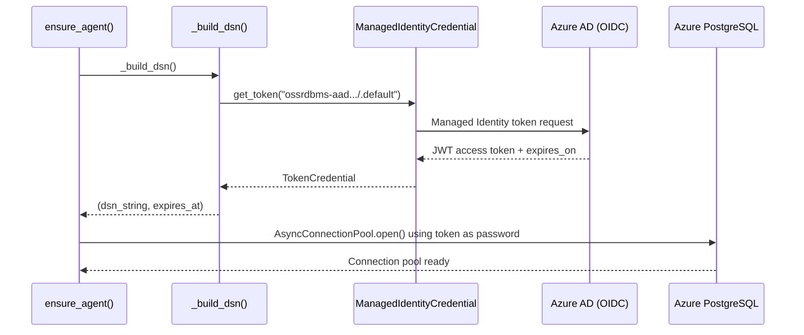
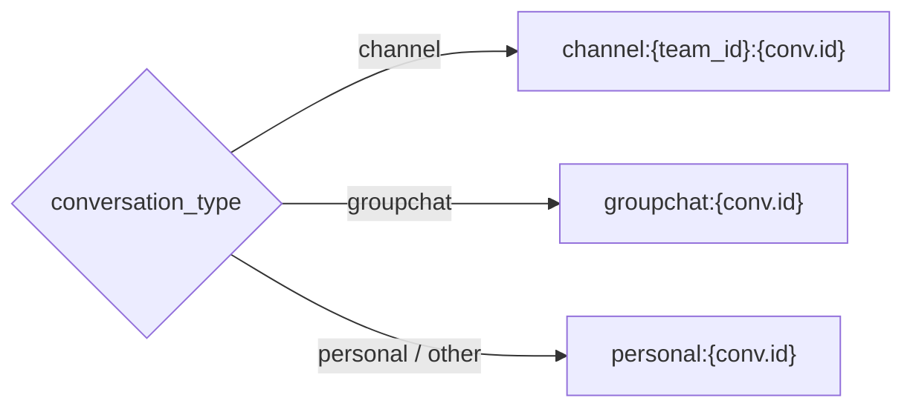
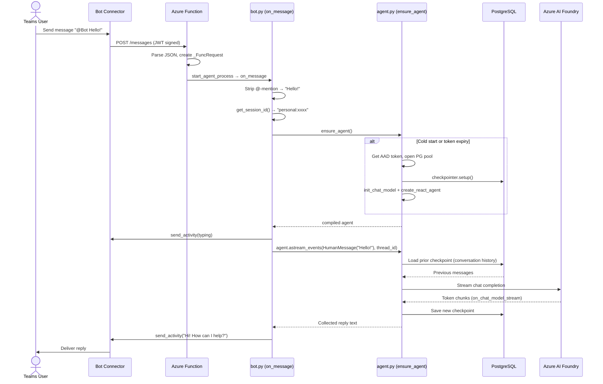

## 1. Overview

This is a **Microsoft Teams bot** deployed as an **Azure Function** that uses a **LangGraph ReAct agent** backed by an **Azure AI Foundry** language model. Conversation history is persisted per-session in **Azure PostgreSQL**, and authentication to both PostgreSQL and the LLM uses **Azure Managed Identity** (no secrets/passwords required at runtime).


### 1.1. Project Structure

| File | Responsibility |
|---|---|
| function_app.py | Azure Functions HTTP entry point - receives Teams webhook POSTs |
| bot.py | Microsoft Agents SDK - activity routing and Teams event handling |
| agent.py | LangGraph agent lifecycle - lazy init, token refresh, conversation management |
| requirements.txt | Python dependencies |


### 1.2. High-Level Architecture



## 2. Components

### 2.1. [function_app.py](function_app.py) - Azure Functions Entry Point

Receives HTTP POSTs from the Bot Connector, validates the JSON body, and delegates to the SDK.

**Key design decisions:**
- `AuthLevel.ANONYMOUS` is intentional - JWT validation is handled by the Microsoft Agents SDK inside `start_agent_process`, not by the Functions host.
- `_CIHeaders` provides a case-insensitive header wrapper so the aiohttp-flavoured SDK works against the Azure Functions `HttpRequest`.
- `_FuncRequest` is a lightweight shim that makes an `HttpRequest` look like an `aiohttp` request (required by `start_agent_process`).



### 2.2. [bot.py](bot.py) - Activity Routing & Teams Handlers

Sets up the `AgentApplication` and registers three activity handlers.

**Module-level singletons (initialised at import time):**

| Object | Type | Purpose |
|---|---|---|
| `STORAGE` | `MemoryStorage` | In-process state store for the SDK |
| `CONNECTION_MANAGER` | `MsalConnectionManager` | MSAL-based auth for outbound calls to Bot Connector |
| `ADAPTER` | `CloudAdapter` | Handles sending/receiving activities |
| `AUTHORIZATION` | `Authorization` | Token validation pipeline |
| `AGENT_APP` | `AgentApplication` | Activity router (decorator-based) |

**Registered handlers:**



#### Message Handler Flow (`on_message`)



### 2.3. [agent.py](agent.py) - LangGraph Agent Lifecycle

This module owns all AI infrastructure: the Managed Identity credential, the PostgreSQL connection pool, the LangGraph checkpointer, and the compiled agent graph. Everything is initialised lazily and refreshed when the AAD token is near expiry.

#### Module-Level Singletons

| Variable | Description |
|---|---|
| `_credential` | `ManagedIdentityCredential` - single AAD credential instance |
| `_pool` | `AsyncConnectionPool` - psycopg3 async pool to PostgreSQL |
| `_checkpointer` | `AsyncPostgresSaver` - LangGraph PG checkpointer |
| `_agent` | Compiled LangGraph `StateGraph` (the ReAct agent) |
| `_token_expires_at` | Unix timestamp of the current AAD token's expiry |
| `_init_lock` | `asyncio.Lock` - prevents concurrent cold-starts |

#### `ensure_agent()` - Double-Checked Locking Pattern

This is the central initialisation function. It uses a **double-checked lock** to handle concurrent coroutines safely without over-serialising.



#### Token-Aware Connection Pool (`_open_pool` / `_build_dsn`)

PostgreSQL on Azure with AAD authentication requires a **short-lived token** as the password. The pool DSN is rebuilt on every `ensure_agent()` call where the token is within 5 minutes of expiry.



#### `get_session_id()` - Conversation Scoping

Maps Teams conversation context to a stable `thread_id` used by LangGraph to isolate conversation history:



#### `clear_conversation()` - Reset History

Deletes all LangGraph checkpoint rows for a session from PostgreSQL:

```sql
DELETE FROM checkpoints        WHERE thread_id = <session_id>
DELETE FROM checkpoint_blobs   WHERE thread_id = <session_id>
DELETE FROM checkpoint_writes  WHERE thread_id = <session_id>
```

## 3. End-to-End Message Flow (Happy Path)



## 4. Environment Variables Reference

| Variable | Used In | Description |
|---|---|---|
| `UAMI_CLIENT_ID` | agent.py | Client ID of the User-Assigned Managed Identity |
| `POSTGRES_HOST` | agent.py | PostgreSQL server hostname |
| `POSTGRES_PORT` | agent.py | PostgreSQL port (default: `5432`) |
| `POSTGRES_DB` | agent.py | Database name |
| `POSTGRES_USER` | agent.py | AAD username for PostgreSQL |
| `POSTGRES_POOL_MAX` | agent.py | Max pool connections (default: `5`) |
| `FOUNDRY_MODEL` | agent.py | Azure AI Foundry model deployment name |
| `FOUNDRY_PROJECT_ENDPOINT` | agent.py | Azure AI Foundry project endpoint URL |
| `AGENT_SYSTEM_PROMPT` | agent.py | System prompt (default: `"You are a helpful assistant."`) |
| `AGENTS_SDK_LOG_LEVEL` | function_app.py | Log level for the Microsoft Agents SDK (default: `WARNING`) |

### 4.1. Microsoft 365 Agents SDK environment variables

Authentication for the M365 agents SDK uses app registration credentials loaded by `load_configuration_from_env` in bot.py.
- Support for `FederatedCredentials` auth type is released in [v0.9.0](https://github.com/microsoft/Agents-for-python/blob/main/changelog.md#microsoft-365-agents-sdk-for-python---release-notes-v090).
- At the point of writing, `FederatedCredentials` auth type is yet to be updated in the [python doc](https://learn.microsoft.com/en-us/microsoft-365/agents-sdk/configure-authentication-msal?pivots=python).
- The [node.js doc for FederatedCredentials](https://learn.microsoft.com/en-us/microsoft-365/agents-sdk/configure-authentication-msal?pivots=nodejs#federatedcredentials) provides the environment variables for `FederatedCredentials` auth type, with difference that python SDK seems to use `CONNECTIONS__SERVICE_CONNECTION__SETTINGS__FEDERATEDCLIENTID` instead of `CONNECTIONS__SERVICE_CONNECTION__SETTINGS__FICCLIENTID`

| Variable | Value |
|---|---|
| `CONNECTIONS__SERVICE_CONNECTION__SETTINGS__AUTHTYPE` | `FederatedCredentials `|
| `CONNECTIONS__SERVICE_CONNECTION__SETTINGS__CLIENTID` | `{app-id-guid} `|
| `CONNECTIONS__SERVICE_CONNECTION__SETTINGS__TENANTID` | `{tenant-id-guid} `|
| `CONNECTIONS__SERVICE_CONNECTION__SETTINGS__AUTHORITY` | `https://login.microsoftonline.com/{tenant-id-guid} `|
| `CONNECTIONS__SERVICE_CONNECTION__SETTINGS__FEDERATEDCLIENTID` | `{managed-identity-client-id} `|
| `CONNECTIONS__SERVICE_CONNECTION__SETTINGS__SCOPE` | `https://api.botframework.com `|

## 5. Key Design Patterns

**Lazy singleton with double-checked locking** - `ensure_agent()` avoids re-initialising the expensive LangGraph agent on every request while remaining safe under `asyncio` concurrency.

**Token rotation without restart** - The 5-minute pre-expiry window means the pool and agent are silently rebuilt before the AAD token expires, avoiding `authentication failed` errors mid-conversation.

**Stateless Azure Function + stateful checkpointer** - The Azure Function itself is stateless and horizontally scalable. All conversation state lives in PostgreSQL, keyed by `thread_id`, so any function instance can continue any conversation.

**aiohttp shim** - `_FuncRequest` and `_CIHeaders` bridge the Azure Functions `HttpRequest` interface to what the Microsoft Agents SDK's `start_agent_process` expects from an `aiohttp` request, avoiding a hard dependency on aiohttp as the host.
