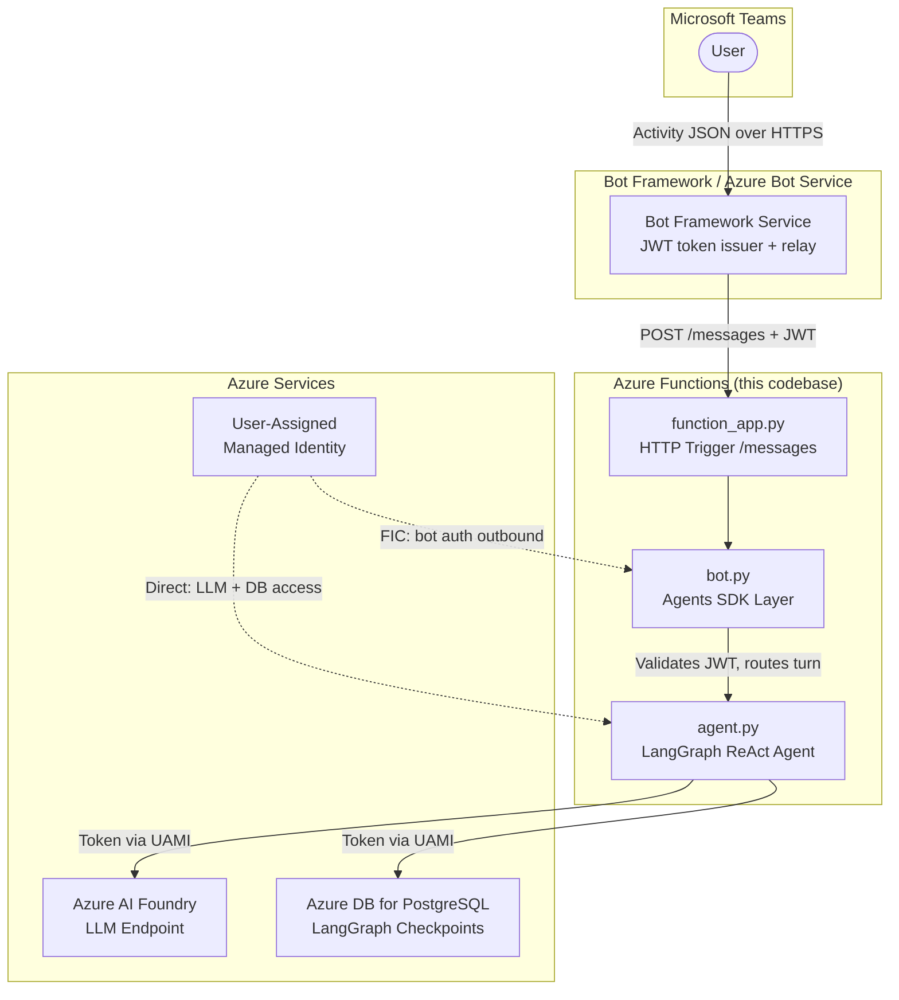
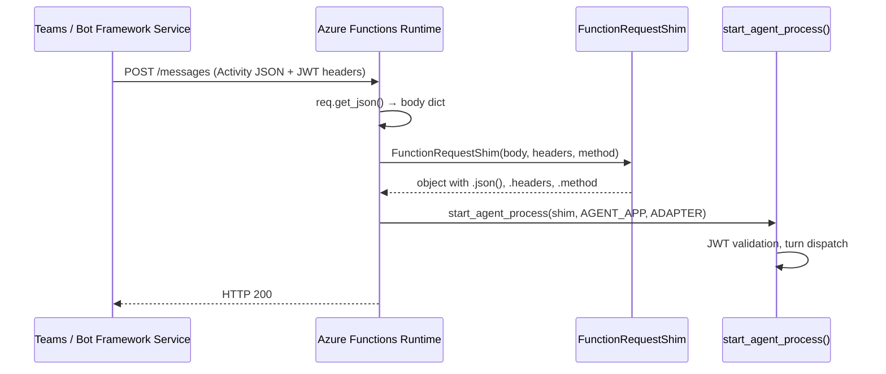
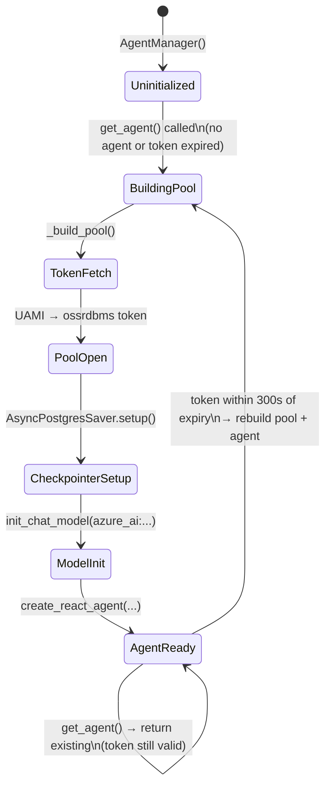
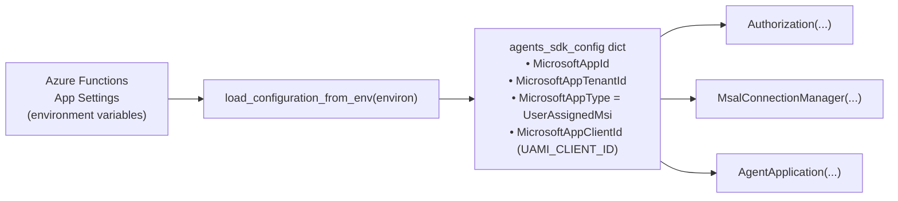
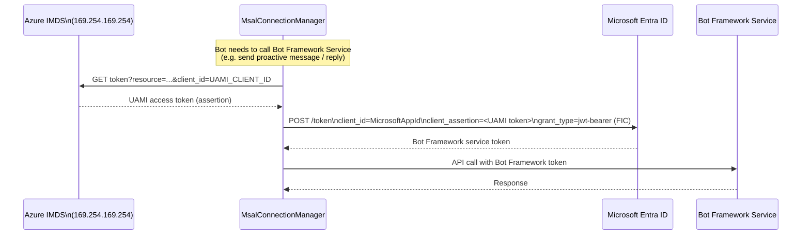
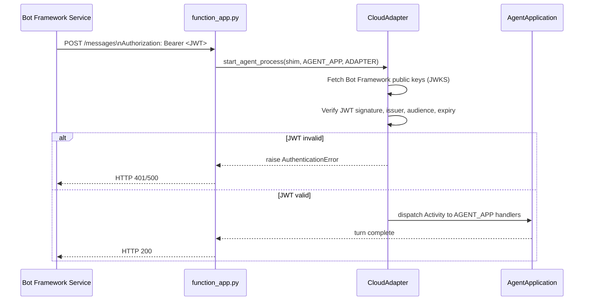
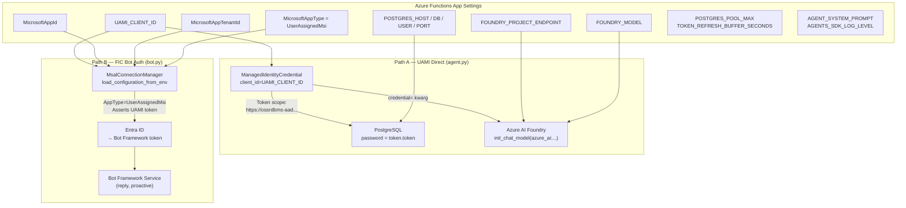
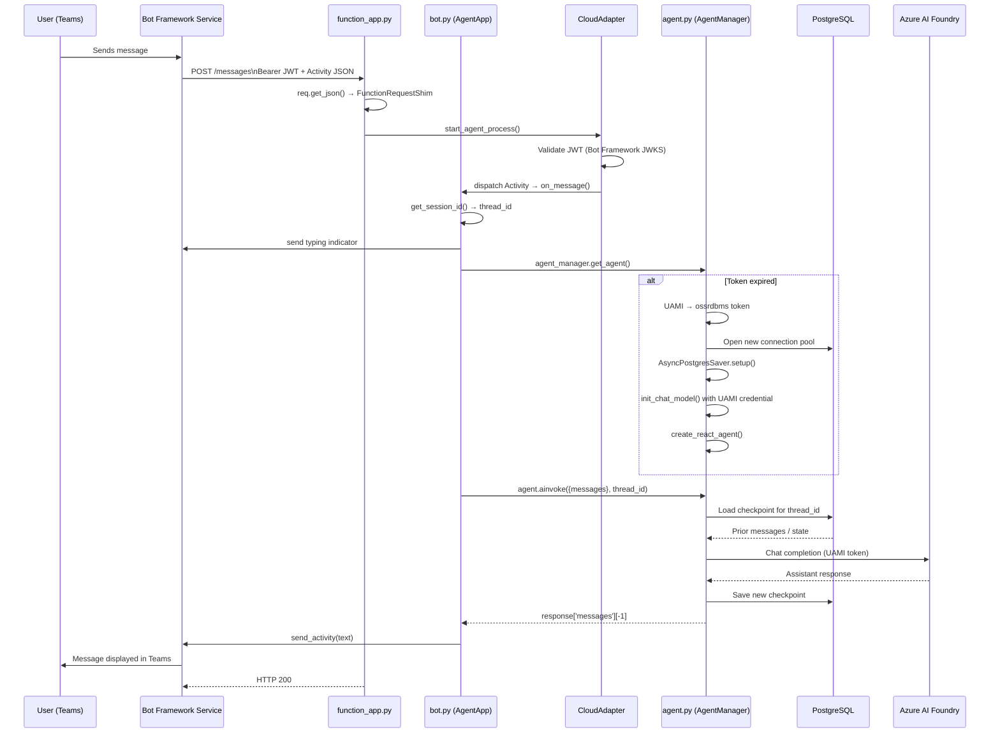

## 1. Overview


This is a **Microsoft Teams bot** deployed as an **Azure Function** that uses a **LangGraph ReAct agent** backed by an **Azure AI Foundry** language model.

Conversation history is persisted per-session in **Azure PostgreSQL**, and authentication to both PostgreSQL and the LLM uses **Azure Managed Identity** (no secrets/passwords required at runtime).


### 1.1. Project Structure

| File | Responsibility |
|---|---|
| [function_app.py](function_app.py) | Azure Functions HTTP trigger; shim layer between Functions SDK and Agents SDK |
| [bot.py](bot.py) | Microsoft Agents SDK setup; Teams protocol, auth, and message routing |
| [agent.py](agent.py) | LangGraph ReAct agent; PostgreSQL-backed memory; Azure AI Foundry LLM |
| [requirements.txt](requirements.txt) | Python dependencies |

The **single UAMI** serves double duty:
- **Directly** in agent.py via `ManagedIdentityCredential` for Foundry and PostgreSQL
- **As a FIC** in bot.py via `MsalConnectionManager` — MSAL presents the UAMI's token as a client assertion to Entra ID, exchanging it for a Bot Framework service token, eliminating the need for a client secret entirely.

### 1.2. High-Level Architecture



## 2. function_app.py — The Entry Point



**Key design decisions:**

- `http_auth_level=func.AuthLevel.ANONYMOUS` — Azure Functions itself does **not** validate the caller. JWT validation is delegated entirely to the Agents SDK (`CloudAdapter`). This is correct: the token is a Bot Framework-issued JWT, not an Azure Functions key.
- **`FunctionRequestShim`** — `start_agent_process` was written for the `aiohttp` request model (expecting `.json()`, `.headers`, `.method`). Azure Functions' `HttpRequest` has a different interface. The shim bridges them with the three attributes the SDK actually reads, without pulling in `aiohttp` as a runtime dependency.
- The logging line `logging.getLogger('microsoft_agents').setLevel(...)` silences the Agents SDK at `WARNING` by default but can be raised via the `AGENTS_SDK_LOG_LEVEL` env var.

## 3. bot.py — Microsoft Agents SDK Layer

### 3.1 Component Setup (module-level singletons)

```python
agents_sdk_config = load_configuration_from_env(environ)   # reads env vars → dict
STORAGE            = MemoryStorage()                         # in-process turn state
CONNECTION_MANAGER = MsalConnectionManager(**agents_sdk_config)
ADAPTER            = CloudAdapter(connection_manager=CONNECTION_MANAGER)
AUTHORIZATION      = Authorization(STORAGE, CONNECTION_MANAGER, **agents_sdk_config)
AGENT_APP          = AgentApplication[TurnState](...)
```

All five objects are **module-level singletons** — created once at cold-start and reused across all invocations within the same Function worker instance.

### 3.2 Message Handlers

| Handler | Trigger | Behavior |
|---|---|---|
| `on_members_added` | `conversationUpdate / membersAdded` | Sends welcome message when bot is added |
| `on_clear` | `/clear` message text | Deletes LangGraph checkpoint rows for the current thread |
| `on_message` | Any `message` activity | Sends typing indicator, invokes ReAct agent, sends reply |
| `on_error` | Any unhandled exception | Sends generic error message to user |

### 3.3 Session ID Strategy

```python
match conv_type:
    case 'channel':   session_id = f"channel:{team_id}:{conv_id}"
    case 'groupChat': session_id = f"groupChat:{conv_id}"
    case _:           session_id = f"personal:{conv_id}"
```

Teams has three conversation scopes. The `session_id` becomes LangGraph's `thread_id`, so conversation history is isolated per-channel, per-group-chat, and per-personal-chat.

## 4. agent.py — LangGraph ReAct Agent

### 4.1 `AgentManager` Lifecycle



**Token refresh logic** uses a double-checked lock pattern:
```python
if self.agent and time.time() < self.token_expiry - BUFFER:
    return self.agent          # fast path, no lock
async with self.lock:
    if self.agent and time.time() < self.token_expiry - BUFFER:
        return self.agent      # re-check after lock
    # ... rebuild
```
This prevents multiple concurrent requests from each rebuilding the pool on token expiry.

### 4.2 LangGraph ReAct Agent Stack

```
create_react_agent(
  model      = AzureAI(Foundry)  ← UAMI credential
  tools      = []                ← extensible
  prompt     = system + MessagesPlaceholder
  checkpointer = AsyncPostgresSaver(pool)  ← persisted memory
)
```

`AsyncPostgresSaver` stores LangGraph checkpoints in three PostgreSQL tables: `checkpoints`, `checkpoint_blobs`, `checkpoint_writes`. The `/clear` command deletes all three for the current `thread_id`.

## 5. Bot Authentication Flow

This is the most complex part. There are **two distinct authentication concerns**:

| Concern | Direction | Mechanism |
|---|---|---|
| **Inbound JWT validation** | Teams → Bot | `CloudAdapter` verifies Bot Framework JWT on every incoming request |
| **Outbound token acquisition** | Bot → Bot Framework Service | `MsalConnectionManager` + UAMI as FIC to prove bot identity |

### 5.1 Environment Variable Loading



`load_configuration_from_env` reads well-known Bot Framework env vars and returns them as a dict that is `**kwargs`-spread into all SDK components.

### 5.2 FIC Bot Authentication (Outbound — UAMI as Federated Identity Credential)

When `MicrosoftAppType=UserAssignedMsi`, the bot has **no client secret**. Instead, the UAMI is configured as a Federated Identity Credential on the App Registration. MSAL acquires a token for the Bot Framework service by presenting the UAMI's managed identity token as the assertion.



### 5.3 Inbound JWT Validation (Incoming — CloudAdapter)



## 6. Environment Variables — Two Authentication Domains



### 6.1. Complete Environment Variable Reference

| Variable | Used In | Purpose |
|---|---|---|
| `UAMI_CLIENT_ID` | agent.py | Client ID of the UAMI used directly by `ManagedIdentityCredential` for PostgreSQL and Foundry authentication |
| `FOUNDRY_PROJECT_ENDPOINT` | agent.py | Azure AI Foundry project URL |
| `FOUNDRY_MODEL` | agent.py | Model deployment name (e.g. `gpt-4o`) |
| `POSTGRES_HOST` | agent.py | PostgreSQL server FQDN |
| `POSTGRES_DB` | agent.py | Database name for checkpoints |
| `POSTGRES_USER` | agent.py | AAD-mapped PostgreSQL user (typically UAMI's display name) |
| `POSTGRES_PORT` | agent.py | Default `5432` |
| `POSTGRES_POOL_MAX` | agent.py | Max pool connections, default `5` |
| `TOKEN_REFRESH_BUFFER_SECONDS` | agent.py | Proactive token refresh window, default `300` |
| `AGENT_SYSTEM_PROMPT` | agent.py | System message for the LLM |
| `AGENTS_SDK_LOG_LEVEL` | function_app.py | SDK verbosity, default `WARNING` |

### 6.2. Microsoft 365 Agents SDK environment variables

Authentication for the M365 agents SDK uses app registration credentials loaded by `load_configuration_from_env` in bot.py.
- Support for `FederatedCredentials` auth type is released in [v0.9.0](https://github.com/microsoft/Agents-for-python/blob/main/changelog.md#microsoft-365-agents-sdk-for-python---release-notes-v090).
- At the point of writing, `FederatedCredentials` auth type is yet to be updated in the [python doc](https://learn.microsoft.com/en-us/microsoft-365/agents-sdk/configure-authentication-msal?pivots=python).
- The [node.js doc for FederatedCredentials](https://learn.microsoft.com/en-us/microsoft-365/agents-sdk/configure-authentication-msal?pivots=nodejs#federatedcredentials) provides the environment variables for `FederatedCredentials` auth type, with difference that python SDK seems to use `CONNECTIONS__SERVICE_CONNECTION__SETTINGS__FEDERATEDCLIENTID` instead of `CONNECTIONS__SERVICE_CONNECTION__SETTINGS__FICCLIENTID`

| Variable | Value |
|---|---|
| `CONNECTIONS__SERVICE_CONNECTION__SETTINGS__AUTHTYPE` | `FederatedCredentials `|
| `CONNECTIONS__SERVICE_CONNECTION__SETTINGS__CLIENTID` | `{app-id-guid} `|
| `CONNECTIONS__SERVICE_CONNECTION__SETTINGS__TENANTID` | `{tenant-id-guid} `|
| `CONNECTIONS__SERVICE_CONNECTION__SETTINGS__AUTHORITY` | `https://login.microsoftonline.com/{tenant-id-guid} `|
| `CONNECTIONS__SERVICE_CONNECTION__SETTINGS__FEDERATEDCLIENTID` | `{managed-identity-client-id} `|
| `CONNECTIONS__SERVICE_CONNECTION__SETTINGS__SCOPE` | `https://api.botframework.com `|

## 7. Full End-to-End Message Flow


