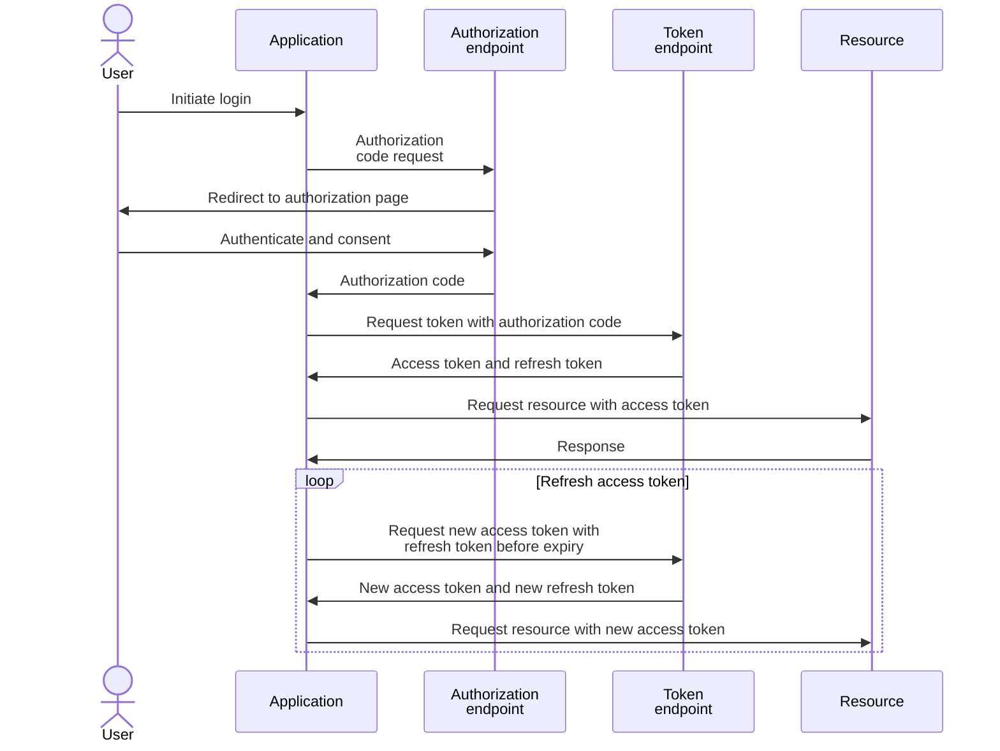
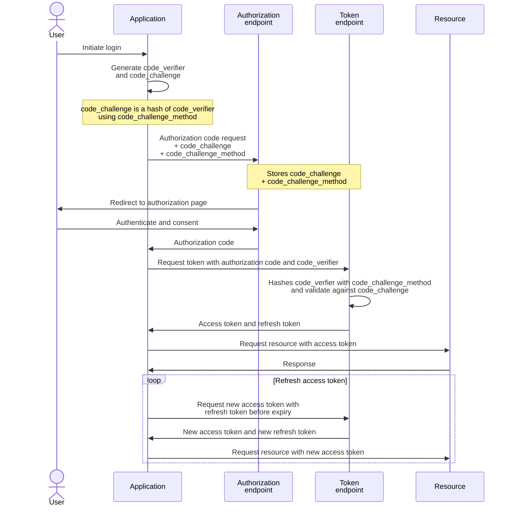

## 1. Client Credentials Flow

```mermaid
sequenceDiagram
  participant B as Application
  participant C as Authorization<br>endpoint
  note over C:Not used in client<br>credentials flow
  participant D as Token<br>endpoint
  participant E as Resource
  B->>D:Request token with application credentials
  D->>D:Verify application<br>credentials
  D->>B:Access token
  B->>E:Request resource with access token
  E->>B:Response
```

Ref: https://learn.microsoft.com/en-us/entra/identity-platform/v2-oauth2-client-creds-grant-flow

Application credentials can be:
1. `client_secret`: symmetric shared secret
2. `client_assertion`: a JWT signed by the client certificate that is registered as credentials for the application; the token endpoint uses the registered client certificate to validate the JWT

## 2. Authorization Code Flow

Ref: https://learn.microsoft.com/en-us/entra/identity-platform/v2-oauth2-auth-code-flow

> [!Note]
>
> PKCE (below) is recommended for all application types, both public and confidential clients, and required by the Microsoft identity platform for single page apps using the authorization code flow.

> [!Note]
>
> Client credentials are also required by the Microsoft identity platform for confidential web apps

## 3. Authorization Code Flow with Proof Key for Code Exchange (PKCE)

Ref: https://learn.microsoft.com/en-us/entra/identity-platform/v2-oauth2-auth-code-flow

> [!Note]
>
> Client credentials are also required by the Microsoft identity platform for confidential web apps
