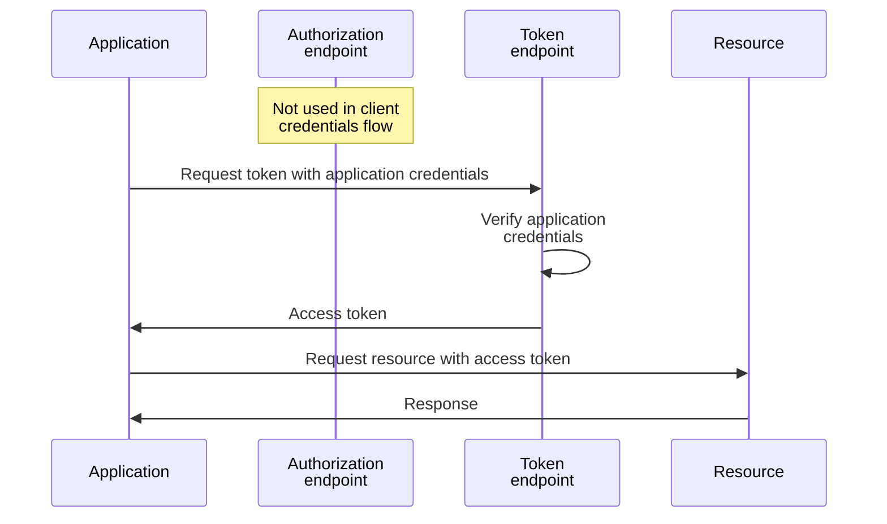
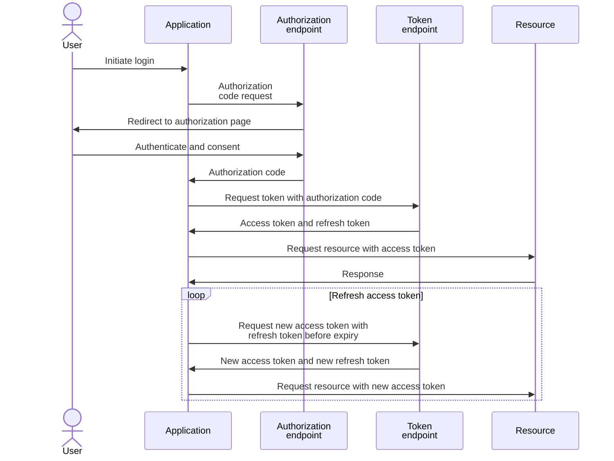
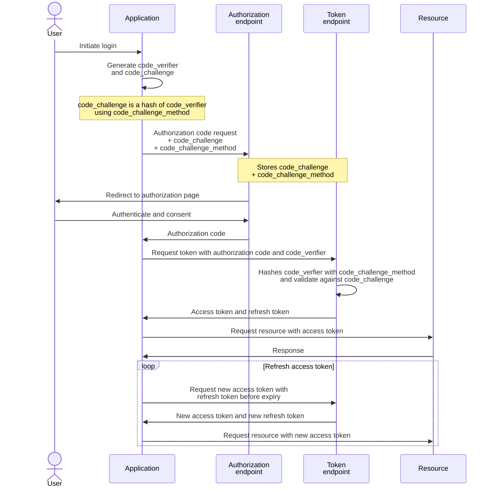

## 1. Open ID with Entra identity

### 1.1. Endpoints for Entra identity

Entra identity endpoints are scoped by `tenant ID` and the details are listed in the OIDC well-known configuration:

```
https://login.microsoftonline.com/$tenant/v2.0/.well-known/openid-configuration
```

The OAuth2 endpoints are in the format:

```
https://login.microsoftonline.com/$tenant/oauth2/v2.0/{token,authorize,devicecode,logout}
```

An endpoint can be referenced by the OIDC well-known configuration, e.g.:

```pwsh
$openid = Invoke-RestMethod https://login.microsoftonline.com/$tenant/v2.0/.well-known/openid-configuration
$token = Invoke-RestMethod $openid.token_endpoint -Method Post -Body $body
```

Or simply using the URI directly, since the endpoints format would likely never change:

|Endpoint|URI|
|---|---|
|`token_endpoint`|`https://login.microsoftonline.com/$tenant/oauth2/v2.0/token`|
|`authorization_endpoint`|`https://login.microsoftonline.com/$tenant/oauth2/v2.0/authorize`|
|`device_authorization_endpoint`|`https://login.microsoftonline.com/$tenant/oauth2/v2.0/devicecode`|
|`end_session_endpoint`|`https://login.microsoftonline.com/$tenant/oauth2/v2.0/logout`|

### 1.2. Setup demo application in Entra identity

In Entra, app registration contains information about the application, usually including URLs for SSO (Single Sign-On)

An enterprise application is created automatically when an app is registered

The enterprise application resource is the service prinicipal (i.e. service account or machine identity) of the application

Permissions can be granted to the application by role assignment to the application resource

#### 1.2.1. Create app registration

> [!Note]
>
> Take note of the `Application (client) ID` and `Directory (tenant) ID`; these will be required later.


#### 1.2.2. Add role assignment for the demo application to access the target resource

Access control actions such as checking access and adding role assignments is performed in the `Access Control (IAM)` pane in each Azure resource

Log Analytics Workspace is shown in this example to illustrate a simple read access for the demo application

Target resource → Access Control (IAM) → Add role assignment:


Select the required role (permissions) for the application, `Reader` is sufficient to demonstrate a simple read:


Select the demo application:

> [!Tip]
>
> https://learn.microsoft.com/en-us/entra/identity-platform/howto-create-service-principal-portal#assign-a-role-to-the-application
>
> By default, Microsoft Entra applications aren't displayed in the available options. Search for the application by name to find it.


> [!Tip]
>
> The following error occurs if the application does not have the appropriate permissions on the resource
>
> ```json
>  {
>   "error": {
>     "code": "AuthorizationFailed",
>     "message": "The client '6e04cd18-bd3d-4fcd-82da-05971d23c28e' with object id '6e04cd18-bd3d-4fcd-82da-05971d23c28e' does not have authorization to perform action 'Microsoft.OperationalInsights/workspaces/read' over scope '/subscriptions/d199f75f-56c4-4977-8bba-33b529ddf9a8' or the scope is invalid. If access was recently granted, please refresh your credentials."
>   }
> }
> ```

## 2. Client Credentials Flow

Ref: https://learn.microsoft.com/en-us/entra/identity-platform/v2-oauth2-client-creds-grant-flow

### 2.1. Flow sequence diagram



Ref: https://learn.microsoft.com/en-us/entra/identity-platform/v2-oauth2-client-creds-grant-flow

Application credentials can be:
1. `client_secret`: symmetric shared secret
2. `client_assertion`: a JWT signed by the client certificate that is registered as credentials for the application; the token endpoint uses the registered client certificate to validate the JWT

### 2.2. Client secret PowerShell example

> [!Tip]
>
> There is a write-up about using PowerShell and cURL for API requests [here](https://github.com/joetanx/setup/blob/main/web-request-notes.md)

#### 2.2.1. Create client secret

> [!Important]
>
> The client secret is displayed **only once**, copy and store it securely right after creation
>
> There is no way to retrieve the client secret if it's lost, it will need to be deleted and create a new one


#### 2.2.2. Retrieve access token from token endpoint

Parameters required to [request access token with a shared secret](https://learn.microsoft.com/en-us/entra/identity-platform/v2-oauth2-client-creds-grant-flow#first-case-access-token-request-with-a-shared-secret):

|Parameter|Value|
|---|---|
|`tenant`|The Entra identity tenant ID|
|`client_id`|The client ID of the demo application|
|`client_secret`|The client secret created for the demo application|
|`grant_type`|`client_credentials`|
|`scope`|The target resource URI suffixed with `.default`<br>e.g. for Log Analytics Workspace `https://management.azure.com/.default`|

Prepare the parameters:

```pwsh
$tenant = '<tenant-id>'
$clientid = '<client-id>'
$clientsecret = '<client-secret>'
$token_endpoint = "https://login.microsoftonline.com/$tenant/oauth2/v2.0/token"
$body=@{
  client_id = $clientid
  client_secret = $clientsecret
  grant_type = 'client_credentials'
  scope = 'https://management.azure.com/.default'
}
```

Request for access token:

> [!Tip]
>
> The `Tee-Object` command in PowerShell works similar to `tee` in Linux
>
> it sends the output of the previous command to both the console and the specified variable

```pwsh
Invoke-RestMethod $token_endpoint -Method Post -Body $body | Tee-Object -Variable token
```

Example output:

```pwsh
token_type expires_in ext_expires_in access_token
---------- ---------- -------------- ------------
Bearer           3599           3599 <access-token-jwt>
```

#### 2.2.3. Access target resource with access token

Azure resources expect access token in the `Authorization` header in the format of: `Bearer: <access-token-jwt>`

Prepare the request header:

```pwsh
$headers = @{
  Authorization='Bearer '+$token.access_token
}
```

Prepare the target resource URL:

```pwsh
$subscriptionid = '<subscription-id>'
$endpointuri = "https://management.azure.com/subscriptions/$subscriptionid/providers/Microsoft.OperationalInsights/workspaces?api-version=2025-02-01"
```

Send the request:

```pwsh
Invoke-RestMethod $endpointuri -Headers $headers | FL
```

Example output:

```pwsh
value : {@{properties=; location=southeastasia; tags=; id=/subscriptions/d199f75f-56c4-4977-8bba-33b529ddf9a8/resourceGroups/SecurityRG/providers/Microsoft.OperationalInsights/workspaces/SecurityLAW; name=SecurityLAW; type=Microsoft.OperationalInsights/workspaces; etag="0900bd5c-0000-1800-0000-68097e870000"}}
```

### 2.3. Client certificate PowerShell example

> [!Tip]
>
> There is a write-up about using PowerShell and cURL for API requests [here](https://github.com/joetanx/setup/blob/main/web-request-notes.md)

#### 2.3.1. Setup client certificate

> [!Important]
>
> Entra supports only RSA certificates for application authentication
>
> Using ECDSA or other certificates leads to _unsupported asymmetric signing algorithm_ error
>
> ```
> Invoke-RestMethod : {"error":"invalid_client","error_description":"AADSTS700027: Invalid JWT token. Unsupported asymmetric signing algorithm.
> ```

Create self-signed certificate:

```pwsh
New-SelfSignedCertificate -Subject 'O=vx Lab, CN=Self-signed App Certificate'-CertStoreLocation cert:\CurrentUser\My
```

Export certificate:

> [!Note]
>
> The [Export-Certificate](https://learn.microsoft.com/en-us/powershell/module/pki/export-certificate#-type) command in PowerShell exports the certificate as DER encoded
>
> Use the method below to export the certificate as Base-64 encoded

```pwsh
$cert = Get-ChildItem -Path cert:\CurrentUser\My | Where-Object { $_.Subject -match 'Self-signed'}
$pem = "-----BEGIN PUBLIC KEY-----`n" +
 [Convert]::ToBase64String($cert.RawData, 'InsertLineBreaks') +
 "`n-----END PUBLIC KEY-----"
$pem | Out-File -FilePath app.cer -Encoding ascii
```

Upload the certificate to the app registration:


#### 2.3.2. Retrieve access token from token endpoint

Parameters required to [request access token with a certificate](https://learn.microsoft.com/en-us/entra/identity-platform/v2-oauth2-client-creds-grant-flow#second-case-access-token-request-with-a-certificate):

|Parameter|Value|
|---|---|
|`tenant`|The Entra identity tenant ID|
|`client_id`|The client ID of the demo application|
|`client_assertion_type`|`urn:ietf:params:oauth:client-assertion-type:jwt-bearer`|
|`client_assertion`|An assertion (JWT) signed with the client certificate|
|`grant_type`|`client_credentials`|
|`scope`|The target resource URI suffixed with `.default`<br>e.g. for Log Analytics Workspace `https://management.azure.com/.default`|

Prepare the parameters:

```pwsh
$tenant = '<tenant-id>'
$clientid = '<client-id>'
$clientsecret = '<client-secret>'
$token_endpoint = "https://login.microsoftonline.com/$tenant/oauth2/v2.0/token"
```

The `client_assertion` needs to be prepared in the following step

#### 2.3.3. Prepare the assertion JWT

Details on the assertion format required by Entra: https://learn.microsoft.com/en-us/entra/identity-platform/certificate-credentials

Prepare JWT header and payload as PowerShell object:

```pwsh
$jwtHeader = @{
  alg = 'PS256'
  typ = 'JWT'
  'x5t#S256' = [System.Convert]::ToBase64String([System.Security.Cryptography.SHA256]::Create().ComputeHash($cert.RawData)).Replace('+', '-').Replace('/', '_').TrimEnd('=')
}
$jwtPayload = @{
  aud = "https://login.microsoftonline.com/$tenant/oauth2/v2.0/token"
  iss = $clientid
  sub = $clientid
  jti = [guid]::NewGuid().ToString()
  exp = [DateTimeOffset]::UtcNow.ToUnixTimeSeconds() + 600
  nbf = [DateTimeOffset]::UtcNow.ToUnixTimeSeconds()
}
```

Convert the JWT header and payload objects to JSON:

```pwsh
$jwtHeaderJson = ConvertTo-Json $jwtHeader -Compress
$jwtPayloadJson = ConvertTo-Json $jwtPayload -Compress
```

Prepare the JWT header and payload JSONs in Base64url-encoded format

> [!Note]
>
> Base-64 encoding can lead to `+`, `/` and `=` characters
>
> The `.Replace()` methods replaces `+` with `-`, `/` with `_`, and omits padding `=` to modify the character set to be safe for use in URLs

```pwsh
$jwtHeaderBase64 = [Convert]::ToBase64String([System.Text.Encoding]::UTF8.GetBytes($jwtHeaderJson)).Replace('+', '-').Replace('/', '_').TrimEnd('=')
$jwtPayloadBase64 = [Convert]::ToBase64String([System.Text.Encoding]::UTF8.GetBytes($jwtPayloadJson)).Replace('+', '-').Replace('/', '_').TrimEnd('=')
```

Read the certificate private key with `GetRSAPrivateKey($cert)`:

```pwsh
$rsaKey = [System.Security.Cryptography.X509Certificates.RSACertificateExtensions]::GetRSAPrivateKey($cert)
```

Sign the JWT:

> [!Note]
> 
> JWT signing algorithms:
> - RS256 (RSA Signature with SHA-256) uses PKCS#1 padding (`[System.Security.Cryptography.RSASignaturePadding]::Pkcs1`)
> - PS256 (RSASSA-PSS with SHA-256) uses PSS (Probabilistic) pading (`[System.Security.Cryptography.RSASignaturePadding]::Pss`)

> [!Note]
>
> Signing with ECDSA - does not work for Entra, for reference only
> 
> ```pwsh
> $ecKey = [System.Security.Cryptography.X509Certificates.ECDsaCertificateExtensions]::GetECDsaPrivateKey($cert)
> $jwtSignature = $ecKey.SignData([System.Text.Encoding]::UTF8.GetBytes($jwtUnsigned), [System.Security.Cryptography.HashAlgorithmName]::SHA256)
> ```

```pwsh
$jwtSignature = $rsaKey.SignData([System.Text.Encoding]::UTF8.GetBytes($jwtUnsigned), [System.Security.Cryptography.HashAlgorithmName]::SHA256, [System.Security.Cryptography.RSASignaturePadding]::Pss)
```

#### 2.3.4. Request for access token

The parameters required to request for access token are finally complete with the `client_assertion`:

```pwsh
$body=@{
  client_id = $clientid
  client_assertion_type = $client_assertion_type
  client_assertion = $client_assertion
  grant_type = 'client_credentials'
  scope = 'https://management.azure.com/.default'
}
```

> [!Tip]
>
> The `Tee-Object` command in PowerShell works similar to `tee` in Linux
>
> it sends the output of the previous command to both the console and the specified variable

```pwsh
Invoke-RestMethod $token_endpoint -Method Post -Body $body | Tee-Object -Variable token
```

Example output:

```pwsh
token_type expires_in ext_expires_in access_token
---------- ---------- -------------- ------------
Bearer           3599           3599 <access-token-jwt>
```

## 3. Authorization Code Flow

Ref: https://learn.microsoft.com/en-us/entra/identity-platform/v2-oauth2-auth-code-flow

### 3.1. Flow sequence diagram

> [!Note]
>
> Application credentials are also required by the Microsoft identity platform for confidential web apps

#### 3.1.1. Authorization Code Flow



> [!Note]
>
> PKCE (below) is recommended for all application types, both public and confidential clients, and required by the Microsoft identity platform for single page apps using the authorization code flow.

#### 3.1.2. Authorization Code Flow with Proof Key for Code Exchange (PKCE)



### 3.2. Postman example

> [!Note]
>
> Postman is used instead of PowerShell because the `Invoke-WebRequest` and `Invoke-RestMethod` do not open browser pop-up for the redirect login

#### 3.2.1. Prepare demo application

Create redirect URI:


Add `Azure Service Management` / `user_impersonation` permission:


#### 3.2.2. Getting access token

The Postman _Authorization_ tab handles all the authorization flow
- Generate the `code_verifier` and hashes the it with the specified `code_challenge_method` to create the `code_challenge`
- Submit authorization code request to the authorization endpoint
- Submit access token request to the token endpoint with the authorization code retrieved

|Parameter|Value|
|---|---|
|Grant Type|Authorization Code (With PKCE)|
|Callback URL|The exact redirect URI configured in the demo application<br>e.g. `http://localhost`|
|Auth URL|Authorization endpoint<br>`https://login.microsoftonline.com/<tenant>/oauth2/v2.0/authorize`|
|Access Token URL|Token endpoint<br>`https://login.microsoftonline.com/<tenant>/oauth2/v2.0/token`|
|Client ID|The client ID of the demo application|
|Client Secret|The client secret created for the demo application|
|Code Challenge Method|SHA-256 recommended, but plain is also supported|
|Code verifier|Leave blank to automatically generate|
|Scope|The target resource URI suffixed with `.default`<br>e.g. for Log Analytics Workspace `https://management.azure.com/.default`
|State|A randomly generated unique value to prevent CSRF, can just leave blank for testing|
|Client Authentication|**Send as Basic Auth header**: encodes client credentials in Base64 and sends them in the `Authorization` header (`Authorization: Basic base64(client_id:client_secret)`)<br>**Send client credentials in body**: sends client credentials as form parameters in the request body (`client_id=your_client_id&client_secret=your_client_secret`)|


Sign-in to user account:


Approve permission to impersonate user:


Access token acquired:


> [!Tip]
>
> The authorization flow of request to authorization endpoint, redirect to user sign-in, and request to token endpoint is captured in the Postman console:
>
> 


Select _Use Token_ and the _Authorization_ header is automatically added with the access token:

> This is similar to the PowerShell example of:
>
> ```pwsh
> $headers = @{
>   Authorization='Bearer '+$token.access_token
> }
>```


Simply send the request:


