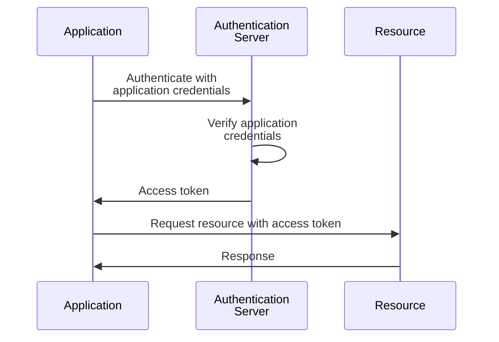
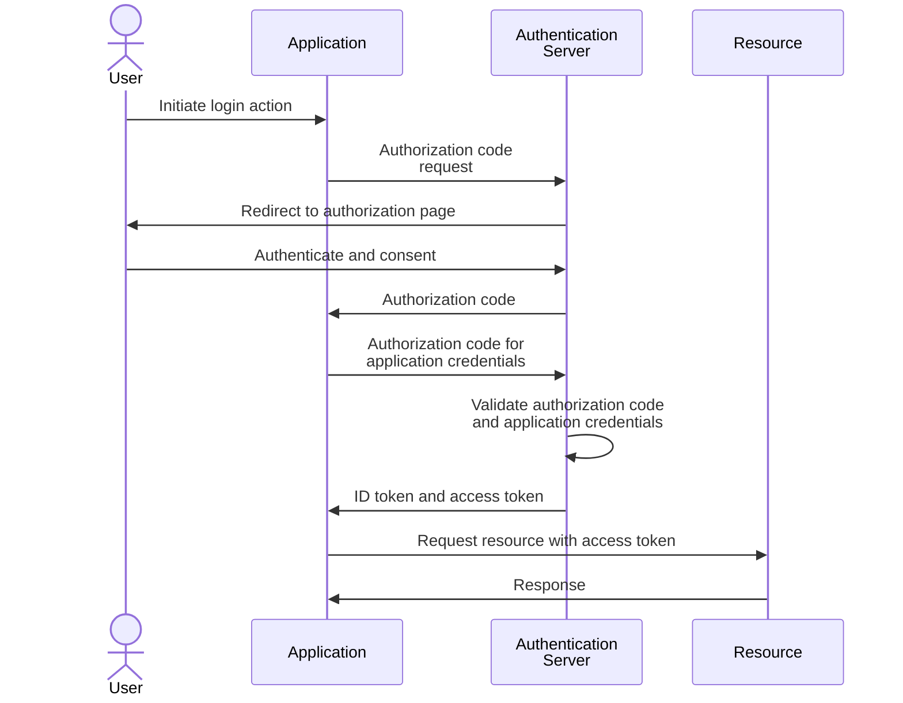
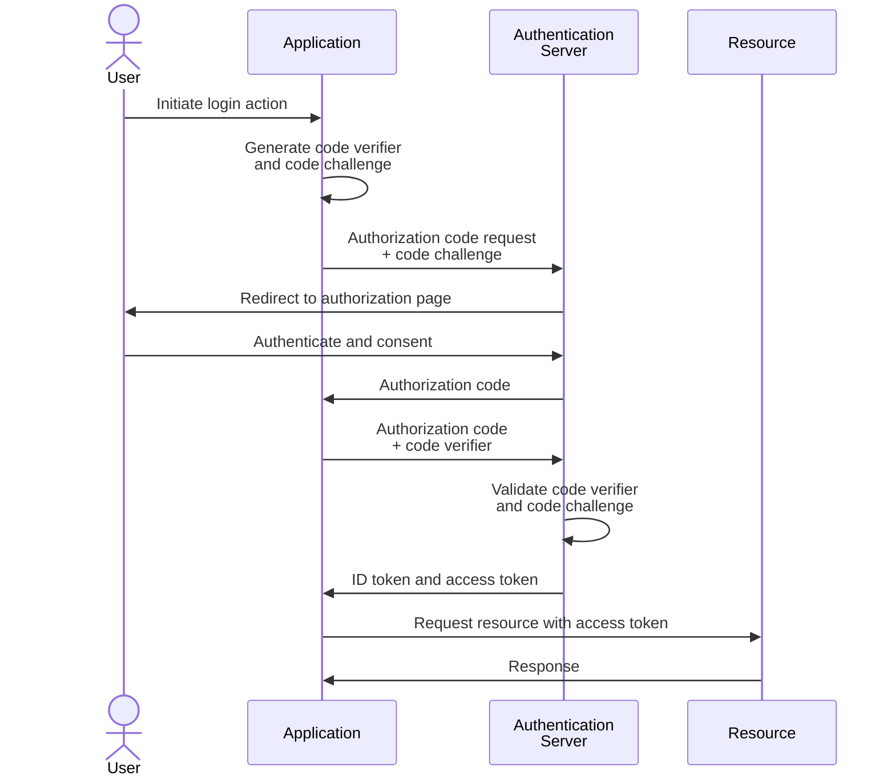

## 1. Client Credentials Flow

```mermaid
sequenceDiagram
  participant A as Application
  participant B as Authentication<br>Server
  participant C as Resource
  A->>B:Authenticate with<br>application credentials
  B->>B:Verify application<br>credentials
  B->>A:Access token
  A->>C:Request resource with access token
  C->>A:Response
```

## 2. Authorization Code Flow

```mermaid
sequenceDiagram
  actor A as User
  participant B as Application
  participant C as Authentication<br>Server
  participant D as Resource
  A->>B:Initiate login action
  B->>C:Authorization code<br>request
  C->>A:Redirect to authorization page
  A->>C:Authenticate and consent
  C->>B:Authorization code
  B->>C:Authorization code for<br>application credentials
  C->>C:Validate authorization code<br>and application credentials
  C->>B:ID token and access token
  B->>D:Request resource with access token
  D->>B:Response
```

## 3. Authorization Code Flow with Proof Key for Code Exchange (PKCE)

```mermaid
sequenceDiagram
  actor A as User
  participant B as Application
  participant C as Authentication<br>Server
  participant D as Resource
  A->>B:Initiate login action
  B->>B:Generate code verifier<br>and code challenge
  B->>C:Authorization code request<br>+ code challenge
  C->>A:Redirect to authorization page
  A->>C:Authenticate and consent
  C->>B:Authorization code
  B->>C:Authorization code<br>+ code verifier
  C->>C:Validate code verifier<br>and code challenge
  C->>B:ID token and access token
  B->>D:Request resource with access token
  D->>B:Response
```
