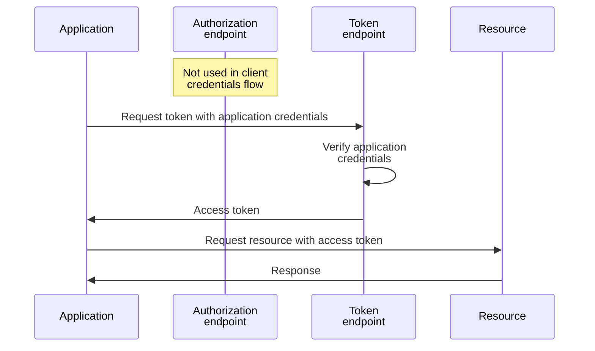
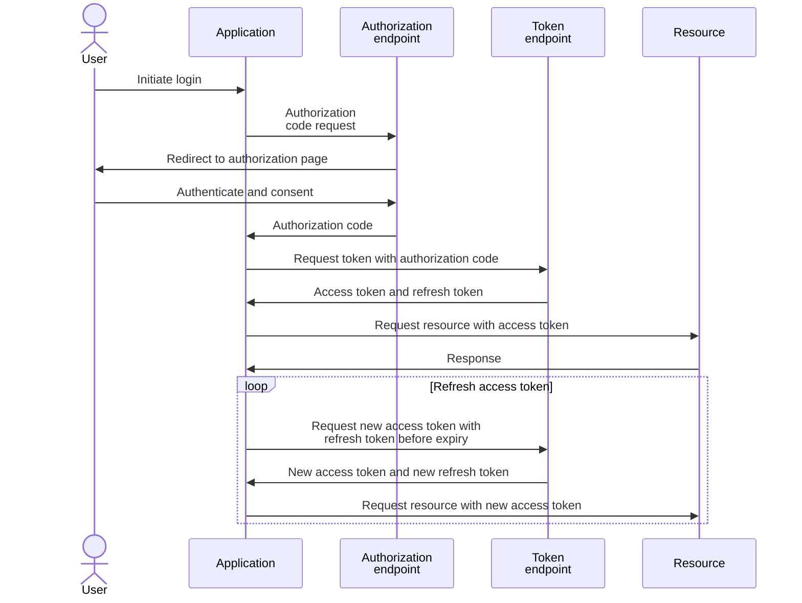
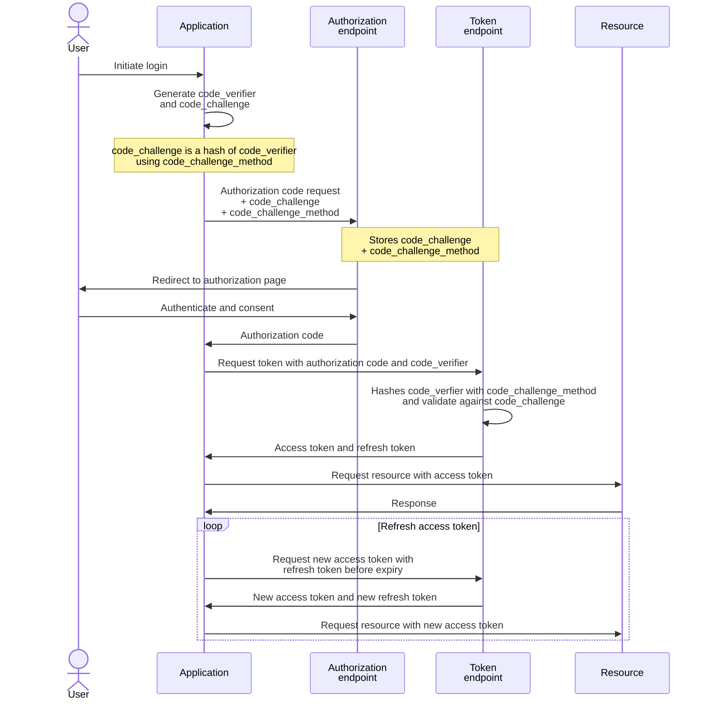

## 1. Open ID with Entra identity

### 1.1. Endpoints for Entra identity

Entra identity endpoints are scoped by `tenant ID` and the details are listed in the OIDC well-known configuration:

```
https://login.microsoftonline.com/$tenant/v2.0/.well-known/openid-configuration
```

The OAuth2 endpoints are in the format:

```pwsh
https://login.microsoftonline.com/$tenant/oauth2/v2.0/{token,authorize,devicecode,logout}
```

An endpoint can be referenced by the OIDC well-known configuration, e.g.:

```pwsh
$openid = Invoke-RestMethod https://login.microsoftonline.com/$tenant/v2.0/.well-known/openid-configuration
$token = Invoke-RestMethod $openid.token_endpoint -Method Post -Body $body
```

Or simply using the URI directly, since the endpoints format would likely never change:

|Endpoint|URI|
|---|---|
|`token_endpoint`|`https://login.microsoftonline.com/$tenant/oauth2/v2.0/token`|
|`authorization_endpoint`|`https://login.microsoftonline.com/$tenant/oauth2/v2.0/authorize`|
|`device_authorization_endpoint`|`https://login.microsoftonline.com/$tenant/oauth2/v2.0/devicecode`|
|`end_session_endpoint`|`https://login.microsoftonline.com/$tenant/oauth2/v2.0/logout`|

### 1.2. Setup demo application in Entra identity

In Entra, app registration contains information about the application, usually including URLs for SSO (Single Sign-On)

An enterprise application is created automatically when an app is registered

The enterprise application resource is the service prinicipal (i.e. service account or machine identity) of the application

Permissions can be granted to the application by role assignment to the application resource

#### 1.2.1. Create app registration

> [!Note]
>
> Take note of the `Application (client) ID` and `Directory (tenant) ID`; these will be required later.


> [!Note]
>
> Redirect URI is required for authorization code flow
>
> 

#### 1.2.2. Create client secret

> [!Important]
>
> The client secret is displayed **only once**, copy and store it securely right after creation
>
> There is no way to retrieve the client secret if it's lost, it will need to be deleted and create a new one


#### 1.2.3. Add role assignment for the demo application to access the target resource

Access control actions such as checking access and adding role assignments is performed in the `Access Control (IAM)` pane in each Azure resource

Log Analytics Workspace is shown in this example to illustrate a simple read access for the demo application

Target resource → Access Control (IAM) → Add role assignment:


Select the required role (permissions) for the application, `Reader` is sufficient to demonstrate a simple read:


Select the demo application:

> [!Tip]
>
> https://learn.microsoft.com/en-us/entra/identity-platform/howto-create-service-principal-portal#assign-a-role-to-the-application
>
> By default, Microsoft Entra applications aren't displayed in the available options. Search for the application by name to find it.


> [!Tip]
>
> The following error occurs if the application does not have the appropriate permissions on the resource
>
> ```json
>  {
>   "error": {
>     "code": "AuthorizationFailed",
>     "message": "The client '6e04cd18-bd3d-4fcd-82da-05971d23c28e' with object id '6e04cd18-bd3d-4fcd-82da-05971d23c28e' does not have authorization to perform action 'Microsoft.OperationalInsights/workspaces/read' over scope '/subscriptions/d199f75f-56c4-4977-8bba-33b529ddf9a8' or the scope is invalid. If access was recently granted, please refresh your credentials."
>   }
> }
> ```

## 2. Client Credentials Flow

Ref: https://learn.microsoft.com/en-us/entra/identity-platform/v2-oauth2-client-creds-grant-flow

### 2.1. Flow sequence diagram



Ref: https://learn.microsoft.com/en-us/entra/identity-platform/v2-oauth2-client-creds-grant-flow

Application credentials can be:
1. `client_secret`: symmetric shared secret
2. `client_assertion`: a JWT signed by the client certificate that is registered as credentials for the application; the token endpoint uses the registered client certificate to validate the JWT

### 2.2. PowerShell Example

> [!Tip]
>
> There is a write-up about using PowerShell and cURL for API requests [here](https://github.com/joetanx/setup/blob/main/web-request-notes.md)

#### 2.2.1. Retrieve access token from token endpoint

The parameters required to [get a token](https://learn.microsoft.com/en-us/entra/identity-platform/v2-oauth2-client-creds-grant-flow#get-a-token) from Entra identity token endpoint:

|Parameter|Value|
|---|---|
|`tenant`|The Entra identity tenant ID|
|`client_id`|The client ID of the demo application|
|`client_secret`|The client secret created for the demo application|
|`grant_type`|`client_credentials`|
|`scope`|The target resource URI suffixed with `.default`<br>e.g. for Log Analytics Workspace `https://management.azure.com/.default`|

Prepare the parameters:

```pwsh
$tenant = '<tenant-id>'
$clientid = '<client-id>'
$clientsecret = '<client-secret>'
$token_endpoint = "https://login.microsoftonline.com/$tenant/oauth2/v2.0/token"
$body=@{
  client_id = $clientid
  client_secret = $clientsecret
  grant_type = 'client_credentials'
  scope = 'https://management.azure.com/.default'
}
```

Request for access token:

> [!Tip]
>
> The `Tee-Object` command in PowerShell works similar to `tee` in Linux
>
> it sends the output of the previous command to both the console and the specified variable

```pwsh
Invoke-RestMethod $token_endpoint -Method Post -Body $body | Tee-Object -Variable token
```

Example output:

```pwsh
token_type expires_in ext_expires_in access_token
---------- ---------- -------------- ------------
Bearer           3599           3599 <access-token-jwt>
```

#### 2.2.2. Access target resource with access token

Azure resources expect access token in the `Authorization` header in the format of: `Bearer: <access-token-jwt>`

Prepare the request header:

```
$headers = @{
  Authorization='Bearer '+$token.access_token
}
```

Prepare the target resource URL:

```pwsh
$subscriptionid = '<subscription-id>'
$endpointuri = "https://management.azure.com/subscriptions/$subscriptionid/providers/Microsoft.OperationalInsights/workspaces?api-version=2025-02-01"
```

Send the request:

```pwsh
Invoke-RestMethod $endpointuri -Headers $headers | FL
```

Example output:

```pwsh
value : {@{properties=; location=southeastasia; tags=; id=/subscriptions/d199f75f-56c4-4977-8bba-33b529ddf9a8/resourceGroups/SecurityRG/providers/Microsoft.OperationalInsights/workspaces/SecurityLAW; name=SecurityLAW; type=Microsoft.OperationalInsights/workspaces; etag="0900bd5c-0000-1800-0000-68097e870000"}}
```

## 3. Authorization Code Flow

Ref: https://learn.microsoft.com/en-us/entra/identity-platform/v2-oauth2-auth-code-flow

### 3.1. Flow sequence diagram

> [!Note]
>
> Application credentials are also required by the Microsoft identity platform for confidential web apps

#### 3.1.1. Authorization Code Flow



> [!Note]
>
> PKCE (below) is recommended for all application types, both public and confidential clients, and required by the Microsoft identity platform for single page apps using the authorization code flow.

#### 3.1.2. Authorization Code Flow with Proof Key for Code Exchange (PKCE)


